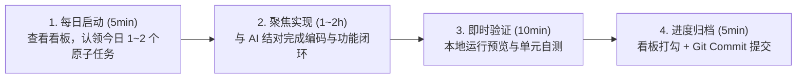

# 「mc」每日推进与研发规划指南 (Daily Development Plan & Roadmap)

> 本文档旨在为 **「mc」多维知识库与协同系统** 提供清晰、可落地、按天推进的日常开发路径与协作节奏，确保每天都有明确的产出与阶段性闭环。

---

## 目录
- [一、 每日推进工作法 (Daily Cadence & Workflow)](#一-每日推进工作法-daily-cadence--workflow)
- [二、 整体演进阶段 (Master Milestones)](#二-整体演进阶段-master-milestones)
- [三、 35天按日精细化拆解规划 (Day-by-Day Sprint Plan)](#三-35天按日精细化拆解规划-day-by-day-sprint-plan)
  - [Sprint 1: 脚手架与核心编辑器 (Day 1 - 7)](#sprint-1-脚手架与核心编辑器-day-1---7)
  - [Sprint 2: 多维数据库引擎与三重视图 (Day 8 - 14)](#sprint-2-多维数据库引擎与三重视图-day-8---14)
  - [Sprint 3: Yjs 实时协同与服务端管道 (Day 15 - 21)](#sprint-3-yjs-实时协同与服务端管道-day-15---21)
  - [Sprint 4: 资产存储、鉴权与邀请闭环 (Day 22 - 28)](#sprint-4-资产存储鉴权与邀请闭环-day-22---28)
  - [Sprint 5: 桌面端、数据迁移与 Docker 交付 (Day 29 - 35)](#sprint-5-桌面端数据迁移与-docker-交付-day-29---35)
- [四、 动态进度跟踪看板 (Living Progress Tracker)](#四-动态进度跟踪看板-living-progress-tracker)
- [五、 与 AI 结对编程的高效推进实践](#五-与-ai-结对编程的高效推进实践)

---

## 一、 每日推进工作法 (Daily Cadence & Workflow)

为了避免“项目宏大但无从下手”或“单日目标过大导致烂尾”，建议采用 **单日微迭代闭环法（Daily Micro-Sprint）**：



### 每日打卡核心原则：
1. **原子化交付**：每天只聚焦一个具体的“可交互点”（如“实现标题块与段落块的快捷键转换”、“完成表格列宽调整”），确保当天能看到实际效果。
2. **状态透明**：每天开始时直接查看本文档第四部分的 **[动态进度看板]**，完成即打勾 `[x]`。
3. **保持主干随时可用**：每天结束时的代码均能正常编译、启动，不遗留阻断性红错。

---

## 二、 整体演进阶段 (Master Milestones)

| 阶段 | 核心目标 | 预计周期 | 关键交付物 |
| :--- | :--- | :--- | :--- |
| **Phase 1: 基础设施与骨架** | Monorepo 工程结构、Docker 开发环境、基础 UI 规范 | 3~4 天 | Turborepo / pnpm 脚手架、Postgres & MinIO 容器环境 |
| **Phase 2: 块级富文本编辑器** | 树状 Block 渲染引擎、常用块类型、快捷斜杠指令 | 7~8 天 | 可流畅编辑、拖拽重排、支持 Markdown 快捷语法的富文本编辑器 |
| **Phase 3: 多维数据库系统** | 表格 (Table)、看板 (Board)、画廊 (Gallery) 视图及基础属性 | 7~8 天 | 支持增删改查、排序、多条件筛选、状态拖拽的多维数据库组件 |
| **Phase 4: 实时协同与服务端** | Yjs CRDT 同步通道、WebSocket 网关、状态持久化 | 7 天 | 双客户端/双标签页毫秒级无冲突编辑与光标感知 |
| **Phase 5: 账户、安全与资产** | 扁平化工作区、管理员引导、邀请码注册、S3 附件上传 | 5 天 | 完整登录邀请闭环、图片/文件附件即时上传渲染 |
| **Phase 6: 客户端与私有化发布** | Tauri 桌面端、数据导入导出 (Markdown/JSON)、一键部署 | 4~5 天 | Docker Compose 一键启动包、Windows/macOS 桌面应用安装包 |

---

## 三、 35天按日精细化拆解规划 (Day-by-Day Sprint Plan)

### Sprint 1: 脚手架与核心编辑器 (Day 1 - 7)
> **阶段目标**：跑通前后端开发环境，构建纯粹丝滑的块级富文本编辑体验。

- [x] **Day 1: mc_web 前端框架与 Notion 风格工作区布局搭建** *(已完成)*
  - 初始化 React 18 + Vite + TypeScript + Tailwind CSS + Lucide 前端工程骨架
  - 实现侧边栏无限层级递归文档树、页面新建/删除/重命名/收藏与展开折叠
  - 实现顶栏动态面包屑、协同状态占位 UI（静态文案，未接入在线感知）与明暗 (Light/Dark) 双主题切换
  - 实现文档详情页：Emoji 图标选择器、Banner 封面图更换、实时响应式大标题
  - 实现全局快捷搜索模态框 (`Ctrl+K` / `Cmd+K`)
  - 验证 TypeScript 零类型错误与 Vite 生产构建顺利通过 (Exit Code 0)
- [x] **Day 2: Block 富文本编辑器核心与常用块类型渲染** *(已完成)*
  - **交付目标**：将详情页静态正文接入编辑器，实现基础块编辑闭环；已完成内核选型与核心组件开发。
  - [x] **内核与数据契约**：完成 TipTap / BlockSuite / 自主轻量块树引擎全维度对比评估；最终确立自主轻量块树引擎方案，保证与 BlockNode 数据契约 1:1 天然对齐，为 Sprint 3 Yjs Y.Array<Y.Map> 协同打通底座；落实唯一稳定 ID、空文档默认段落及未知块保底渲染机制。
  - [x] **组件与状态绑定**：在 `mc_web/src/components/editor/` 建立 `BlockEditor`、`BlockItem`、`TextBlock`、`DividerBlock`、`BlockTypeSelector` 等模块化组件，替换 `DocumentPage.tsx` 静态正文；通过 Store `updateDocumentBlocks` 实现不可变响应式更新，通过 `key={doc.id}` 彻底杜绝切页串写与闭包污染。
  - [x] **基础块操作**：实现 Paragraph、H1-H3 实时编辑与类型切换（保留文本内容与稳定 ID），提供悬浮操作条与下拉切换入口；实现 Divider 分割线插入与删除，末尾分割线后自动追加段落确保可继续输入。
  - [x] **键盘与输入边界**：实现 Enter 光标处拆分（标题拆分降级为段落，块首 Enter 向上插入段落）；实现 Backspace 在光标 0 处合并（标题降级段落、首块越界拦截保底、分割线相邻安全删除）；完整处理中文输入法 IME 合成锁 (`isComposing`) 避免误拆误删；支持纯文本多行粘贴自动分块与撤销/重做 (Undo/Redo) 历史栈。
  - [x] **验收归档**：编写并执行自动化测试套件 `scripts/verify-day2.mjs` 全部通过，`npm run build` 零错误通过。
- [x] **Day 3: 列表与待办块实现 (Todo / List)** *(已完成)*
  - **交付目标**：在轻量块编辑器上交付可编辑的 Bullet list、Numbered list 和 Todo；列表嵌套使用相邻块的 `properties.level` 表示，保持后续 Yjs 块数组映射的直接性。
  - [x] **数据契约与兼容**：为三种列表块统一定义 `properties.level`（非负整数，缺省 `0`），并定义 Todo 的 `properties.checked`（布尔值，缺省 `false`）。保留既有块 ID 与文本，兼容旧示例 Todo；未知或非法 level 规范化为 `0`。
  - [x] **渲染与可访问性**：扩展 `BlockItem` 和类型选择器，分别渲染项目符号、按同级连续列表项计算的有序序号和键盘可操作的 checkbox。缩进反映 level；勾选后文本划线但仍可编辑。
  - [x] **编辑与转换**：三种列表块复用现有输入、IME、粘贴、撤销/重做能力。与 Paragraph/H1-H3 互相转换时保留文本和 ID，并正确初始化或保留 level / checked；在列表内多行粘贴时创建相同类型、同级的新块。
  - [x] **Enter / Backspace**：非空列表或待办在光标处拆分为相同类型和同级的新块；空列表或未勾选空待办按 Enter 退出为同级 Paragraph；块首 Backspace 先与兼容前项合并，前项不存在时降级为 Paragraph，且不丢失除 Todo 勾选状态外的块属性。
  - [x] **Tab 嵌套规则**：仅当前一相邻块属于相同列表家族（Bullet、Numbered 或 Todo）时，`Tab` 才将当前项缩进一级；`Shift+Tab` 将 level 减一，根级保持不变。禁止跳级、循环或跨段落/标题缩进，编号与视觉层级必须即时重算。
  - [x] **验收与回归**：新增真实组件测试与 `verify:day3` 脚本，覆盖渲染、勾选、转换、拆分/退出、合并、Tab/Shift+Tab、编号、嵌套边界、粘贴和切页隔离；执行 `npm test`、`npm run verify:day2`、`npm run verify:day3`、`npm run build`，并手工检查键盘导航、中文输入法、亮暗主题和窄屏布局后再标记完成。
- [x] **Day 4: 增强块组件 (Code / Quote / Callout)** *(已完成)*
  - **交付目标**：在轻量块编辑器上交付具备数据规范化、交互安全、键盘流转闭环的 Code、Quote 与 Callout 增强块组件。
  - [x] **数据契约与安全**：在 `blockUtils.ts` 定义 Code 的 `language`（支持 14 种主流语言，缺省 `plaintext`）与 `wrap`（布尔值，缺省 `false` 横向滚动）；定义 Callout 的 `icon`（缺省 `💡`）与 5 色基调 `tone` (`neutral`, `info`, `success`, `warning`, `danger`)；实现 `isTextMergeable` 容器隔离白名单与 `cleanBlockProperties` 跨类型属性清洗，彻底杜绝属性污染。
  - [x] **Code block (代码块)**：
    - 采用 Prism.js token 纯 React 节点递归渲染语法树，100% 杜绝 `dangerouslySetInnerHTML` 与 XSS 注入风险。
    - 工具栏支持 14 种编程语言动态选择、横向滚动与自动折行切换、一键复制到剪贴板（带 2s 成功反馈与非阻塞降级）。
    - 键盘交互：支持 `Tab` 在光标处缩进 2 个空格、`Shift+Tab` 缩退当前行 2 个空格；支持 `Ctrl/Cmd+Enter` 在下方插入段落并自动聚焦退出；空代码块按 `Backspace` 降级为普通段落。
  - [x] **Quote block (引用块)**：
    - 采用语义化左侧强调边框 (`border-l-4 border-blue-500`) 与斜体排版，复用公共文本编辑能力。
    - 键盘交互：非空内容按 `Enter` 在光标处拆分为两个引用块；空白引用块按 `Enter` 退出为普通段落；空白引用块按 `Backspace` 降级为普通段落；首项退格向可合并文本前项安全合并。
  - [x] **Callout block (提示块)**：
    - 升级为独立多功能容器组件，左侧支持 Popover 快速选择 12 款预设常用 Emoji/图标，右上角悬浮支持 5 种主题色彩基调切换。
    - 键盘交互：非空提示块按 `Enter` 拆分出同等图标与色调的同类提示块；空提示块按 `Enter` 退出为普通段落；空提示块按 `Backspace` 降级为普通段落。
  - [x] **容器边界隔离保护**：
    - 在 `BlockEditor.tsx` 中落实容器隔离：当在 Code 或 Callout 下方块按 `Backspace` 时，严格禁止段落/列表文字合入容器破坏结构，仅安全转移光标焦点至容器末尾。
  - [x] **历史回退与多页隔离**：
    - 所有语言、色调、图标、折行修改与类型转换完整接入撤销/重做 (Undo/Redo) 历史栈。
  - [x] **测试套件与生产构建**：
    - 新增 `scripts/verify-day4.mjs` 覆盖语言/折行/色调/图标规范化、属性清洗、容器隔离白名单、Tab 缩进与状态机流转。
    - 扩充 Vitest 组件测试至 **33 项**（全量覆盖代码块渲染与 Prism 主题高亮、语言折行切换、剪贴板复制、Tab 缩进与行首/多行 Shift+Tab 缩退、IME 输入法合成期安全防护、XSS 注入防御、引用块拆分退出、提示块图标色调切换、容器隔离退格防护与 Store Undo/Redo）。
    - 验证全量通过：`npm test` (33/33 通过)、`npm run verify:day2` (通过)、`npm run verify:day3` (通过)、`npm run verify:day4` (通过)、`npm run build` (零错误生产打包)。
- [x] **Day 5: 斜杠指令 (Slash Command `/`) 与浮动菜单 (Bubble Menu)**
  - **交付目标**：实现沉浸式流式写作的核心快捷交互——块级斜杠命令弹出面板与划选富文本浮动工具栏，彻底摆脱必须依赖鼠标左侧按钮切换类型与格式的低效链路。
  - [x] **斜杠指令系统 (Slash Command `/`)**：
    - 在段落及文本块中输入 `/` 呼出轻量快捷命令菜单；计算光标相对视口位置精准浮动定位（支持视口下边缘自动反向翻折）。
    - 快速过滤引擎：支持全拼、拼音首字母（如 `dm`/`daima` 匹配代码块，`bt`/`biaoti` 匹配各级标题，`db`/`daiban` 匹配待办清单，`ts`/`tishi` 匹配高亮块）及英文关键词（如 `h1`-`h3`, `code`, `todo`, `quote`, `callout`, `divider`）。
    - 键盘交互流转：`↑` / `↓` 循环高亮候选指令并自动滚动视口跟随，`Enter` / `Tab` 确认选中转换，`Escape` 或 Backspace 删掉 `/` 时注销关闭。
    - 文本与类型转换闭环：确认指令后自动清除触发字符 `/` 及后续检索词，调用统一转换通道迁移块属性并保持光标位置，无缝纳管于 Undo/Redo 历史栈。
  - [x] **选区浮动工具栏 (Bubble Menu)**：
    - 监听文本划选事件（选区非折叠且字符数 > 0），动态居中浮动在选区正上方（视口顶部空间不足时自动下翻）。
    - 6 种标准行内格式化：加粗 (`Bold`)、斜体 (`Italic`)、下划线 (`Underline`)、删除线 (`Strikethrough`)、行内代码 (`Inline Code`)、超链接 (`Hyperlink`)。
    - 激活态动态感知：根据当前选区上下文高亮对应已启用的格式化按钮。
    - 超链接交互：点击超链接弹出 URL 输入浮层，支持设置链接、修改链接、取消链接，附带基础合法 URL 校验。
    - 焦点保护：所有工具栏按钮使用 `onMouseDown={(e) => e.preventDefault()}`，杜绝点击时选区失焦坍塌。
  - [x] **测试套件与生产构建**：
    - 新增 `scripts/verify-day5.mjs` 并注册 `verify:day5` 脚本，验证拼音/英文检索算法、斜杠指令状态机、行内格式数据安全。
    - 扩充 Vitest 组件集成测试至 40 项，全量断言斜杠指令触发/过滤/键盘选择/转换，以及 Bubble Menu 划选唤出/格式切换/防失焦/超链接全流程。
    - 全量回归 Day 2 ~ Day 4 验收脚本，TypeScript 零错误，Vite 生产构建成功。
- [x] **Day 6: 块级拖拽排序与批量操作** *(已完成)*
  - 实现块左侧 `6-dot` 悬浮手柄（Grip handle）
  - 支持单块与多块 HTML5 拖拽重排与平滑放置指示器 (Drop Indicator)
  - 支持 Shift+Click 连续范围多选、Ctrl/Cmd 单项反选与多块批量高亮
  - 支持一键 Backspace/Delete 批量删除、Ctrl+C 批量 Markdown 复制与底部悬浮工具栏
  - 批量操作与拖拽重排完整接入 Undo/Redo 历史栈
  - Vitest 集成测试扩充至 46 项，注册 `verify:day6` 验收脚本全量通过
- [x] **Day 7: 本地离线持久化 (IndexedDB) 与 Sprint 1 阶段总结** *(已完成)*
  - **IndexedDB 数据层**：定义版本化 schema (`WorkspaceSnapshot` v1) 与原生 Promise 封装 `IndexedDBStorage` / `MemoryStorage`；首屏异步 hydration 先载入快照，无快照时载入默认示例数据，彻底防止初始数据覆写用户本地编辑。
  - **自动保存与容错**：对页面增删改、块更新、收藏、工作区名称、侧边栏折叠与主题变更执行 500ms 防抖持久化；顶栏新增存储状态实时反馈（`已保存本地` / `保存中...` / `存储降级` / `离线就绪`）；存储异常或受限环境下自动降级为纯内存模式，非阻塞用户正常编辑。
  - **页面树完整性与级联删除**：交付 `cascadeDeletePage` 算法，递归级联删除页面及其所有嵌套子孙页面，根除孤立 `parentId` 残留；删除当前激活页时智能回退至父级、首个顶级或可用页面。
  - **全量自动化验证与阶段收尾**：新增 `scripts/verify-day7.mjs` 验收脚本并在 `package.json` 注册 `verify:day7`；Vitest 扩充至 **54 项用例全部通过**，全量回归 Day 2 ~ Day 6 脚本零错误，TypeScript 零错误，Vite 生产构建成功；完成 Sprint 1 阶段总结与向 Sprint 2 多维数据库的架构交接说明。

---

### Sprint 2: 多维数据库引擎与三重视图 (Day 8 - 14)
> **阶段目标**：实现类似 Notion 的结构化数据表格，并无缝切看板与画廊视图。

- [x] **Day 8: 多维数据库 Schema 设计与底层数据层** *(已完成)*
  - **架构边界**：数据库块仅保存稳定的 `databaseId` 引用，Database / Property / Row / Cell 使用规范化实体表独立存储于 Workspace 根级字典，严禁把整张表嵌入 `BlockNode.properties`；明确页面删除、数据库引用与行数据之间的所有权规则。
  - **Schema 契约**：定义 `DatabaseSchema`、`DatabaseProperty`、`DatabaseRow`、`DatabaseCell`、可扩展的 `PropertyType` (title, text, number, select, multiSelect, checkbox, date, url) 与 `CellValue` 联合类型，严格维护唯一主标题列、`propertyOrder` / `rowOrder` 1:1 无悬空严格对应等不变量。
  - **纯函数数据层**：交付 `createDatabase`、`validateDatabaseSchema`、`normalizeDatabaseSchema` 以及列与行的不可变 CRUD 纯函数；提供严密的不变量防御（禁止删除主标题列、禁止修改主标题列类型、多标题列降级为 text、删除列原子化级联移除所有行的对应 cell）。
  - **响应式 Store**：以 Zustand slice 形式接入现有工作区 Store，提供 12 项数据库增删改查 actions 与 selectors，每次操作触发 500ms 防抖自动持久化。
  - **持久化迁移**：将 `WorkspaceSnapshot` 升级为 v2，提供显式 `v1 -> v2` 纯函数迁移（自动初始化 `databases` 字典并规整数据），保证旧工作区无损向下兼容；未知高版本继续零覆盖保护。
  - **块树接入基线**：补齐 `database` 块的属性清洗与缺失数据库降级卡片；斜杠指令支持 `/sjk`、`/table`、`/db`、`/biaoge` 快速创建并插入多维数据库块；为 Day 9 表格视图提供稳定入口。
  - **验收与回归**：新增 `verify:day8` 验收脚本并在 `package.json` 注册，Vitest 真实组件测试扩充至 **58 项全部通过**；Day 8 专项数据层脚本与 `tsc` 均通过。2026-09-19 独立复核时隔离输出目录构建成功，但默认 `dist/assets` 清理仍因 `EPERM` 失败，列为 Day 9 并行 P1 环境收尾项。
- [x] **Day 9: 表格视图 (Table View) 核心交互** *(已完成)*
  - **组件与数据边界**：将 `DatabaseBlock` 收敛为容器卡片，拆分 `DatabaseTable`、`TableHeader`、`TableRow`、`TableCell`；组件仅通过 `databaseId` 与细粒度 selector 读取规范化实体，禁止复制整库到局部 state。
  - **表格渲染与滚动**：按 `propertyOrder` / `rowOrder` 稳定渲染表头、行与空状态；支持横向滚动、纵向平滑滚动、吸顶表头与首列可辨识样式，200 行基准数据下滚动无明显卡顿。
  - **列宽拖拽**：基于 Pointer Events 实现调整手柄，拖动期间实时预览，`pointerup` 时仅提交一次 `updateDatabaseProperty`；限制宽度 `120px ~ 600px`，处理 pointer capture、组件卸载与全局监听器清理。
  - **基础内联编辑**：完成 `title` / `text` 单元格的双击或 Enter 进入编辑；Enter（向下移动）、Tab（向右移动）、Shift+Tab（向左移动）、失焦提交，Escape 取消；中文输入法合成阶段安全防护不误提交；其他字段保持安全只读，专用编辑器留给 Day 10。
  - **键盘与可访问性**：采用 roving tabindex 管理单元格焦点；非编辑态支持方向键移动，补齐 grid/row/columnheader/gridcell 语义与可见焦点环。
  - **行级最小闭环**：提供“新增一行”入口与空表引导，新增后自动聚焦新行标题单元格；行数据修改复用 Day 8 Store action，并继续触发防抖持久化。
  - **P1 环境收尾**：已完成默认输出目录连续两次执行 `npm run build` 成功（退出码 0），完全闭环。
  - **验收标准**：新增 `verify:day9` 与真实组件测试（Vitest 扩充至 66 项并通过），覆盖稳定行列映射、列宽边界/取消语义/单次提交、初始 Tab 停靠点、提交/取消/Tab 导航/IME、添加行、UI 刷新恢复与 200 行真实组件挂载基线；Day 2 ~ Day 8 历史专项脚本零回归。默认构建连续两次通过，全面达成验收标准。
- [x] **Day 10: 基础字段类型系统 (Property Types)** *(已完成)*
  - **数据契约与原子安全迁移**：为 5 大基础类型（text, number, checkbox, select, multiSelect）定义统一的空值、解析、规整与校验规则；标签值统一持久化稳定 option ID，兼容并规整旧标签名称数据；收紧 options 缺失引用校验。
  - **专用单元格编辑器**：在现有 `TableCell` 调度层下拆分 `TextCellEditor`、`NumberCellEditor`、`SelectCellEditor`、`MultiSelectCellEditor`；保持 Enter/Tab/Shift+Tab/Escape、失焦提交与 IME 行为一致。
  - **字段与选项配置**：表头提供新增列快速入口与下拉类型菜单，支持直接选择创建 8 类字段；支持列重命名、字段类型切换/删除；选项管理支持新增、重命名、8 款预设色彩选择与删除。
  - **类型安全迁移**：字段切换类型或删除标签选项时通过 `migrateCellForTypeChange` 与 `changePropertyType` 原子化转换/清理受影响单元格，禁止产生悬空 option ID、`NaN`、无限值；破坏性切换弹出受影响行数确认框。
  - **键盘与无障碍**：Checkbox 支持 Space 键即时切换与单击切换；Select/Multi-select 弹层打开时通过 `stopPropagation` 隔离 Grid 导航，关闭后归还原单元格焦点。
  - **持久化与性能**：全部变更复用细粒度 Store action 与 500ms 防抖保存；200 行大数据量整列原子类型迁移耗时 < 1ms。
  - **全量验收证据**：`verify:day10` 与 Vitest 80/80 + 专项 6/6 全部通过；Day 2 ~ Day 9 历史回归及 `npx tsc --noEmit` 零错误；默认生产构建连续两次成功（退出码 0）。
- [x] **Day 11: 扩展字段类型与行详情弹窗 (Extended Property Types & Row as Page)** *(已完成)*
  - **扩展字段契约**：交付 Date（本地 `YYYY-MM-DD` 严格格式校验，杜绝时区漂移与虚构日期）、URL（严格安全协议白名单 `http/https/mailto`、自动补全 `https://`、恶意协议拦截 `javascript:/data:`、外链安全属性）与 Created Time（纯只读元数据派生字段，从 `DatabaseRow.createdAt` 读取，禁止写入 `row.cells`）。
  - **专用单元格编辑器**：交付 `DateCellEditor`（支持键盘输入、Enter/Tab 提交、Escape 回退原值、错误状态提示与 `aria-invalid`）、`UrlCellEditor`（自动补全协议、恶意协议拦截、外部链接安全打开）与 `CreatedTimeCell`（只读展示，无额外 tab stop）。
  - **表头新增字段下拉菜单**：表头新增列入口拆分为快速添加文本列按钮与类型下拉菜单触发器，支持直接从下拉菜单选择并添加 8 种字段类型。
  - **Row as Page 数据模型与正文编辑**：`DatabaseRow` 扩展 `blocks?: BlockNode[]`；`BlockEditor` 解耦为受控/注入模式；旧快照自愈保底默认段落；行删除级联清理正文。
  - **行详情弹窗 (DatabaseRowDetail)**：交付 `role="dialog"` 抽屉弹窗，顶部主标题与属性网格实时双向同步，正文内嵌 `BlockEditor`，完整支持焦点捕获、Escape 关闭与焦点精确归还。
  - **全量测试与回归**：新增 `scripts/verify-day11.mjs`（6 大核心契约与 200 行基准耗时全部达标），Vitest 真实组件测试扩充至 **80 项全部通过**，Day 2 ~ Day 10 全量历史回归零报错，默认生产构建连续两次以退出码 0 成功打包。
- [ ] **Day 12: 看板视图 (Board / Kanban View)**
  - 按单选/状态字段自动分组分列
  - 卡片在列间拖拽移动，自动更新所属状态字段
- [ ] **Day 13: 画廊视图 (Gallery View) 与视图切换器**
  - 网格卡片布局，支持封面图展示与自定义展示字段开关
  - 顶栏 Tab 视图切换器（在同一个 Database 上平滑切换 Table / Board / Gallery）
- [ ] **Day 14: 筛选 (Filter) 与 排序 (Sort) 引擎**
  - 支持多字段组合条件筛选（如 `状态等于 In Progress` 且 `优先级等于 High`）
  - 支持升序/降序多重排序，Sprint 2 综合体验调优

---

### Sprint 3: Yjs 实时协同与服务端管道 (Day 15 - 21)
> **阶段目标**：打通双人/多人毫秒级实时协同、光标感知与服务端持久化。

- [ ] **Day 15: 后端 Hocuspocus / y-websocket 服务搭建**
  - 使用 Node.js + Hocuspocus 搭建轻量级 WebSocket 协同服务
  - 配置客户端 Yjs Provider 与 WebSocket 自动心跳重连
- [ ] **Day 16: 编辑器 Yjs 双向数据绑定与无冲突合并**
  - 将前端编辑器状态与 Yjs Doc 绑定
  - 测试两个浏览器窗口同时输入，验证无锁自动合并（Zero-conflict merge）
- [ ] **Day 17: 实时光标与在线人员感知 (Awareness)**
  - 实现协同光标（带用户名、随机分配头像颜色的实时光标飘浮）
  - 顶栏展示当前正在浏览/编辑该页面的在线人员头像列表
- [ ] **Day 18: 多维数据库的 Yjs 协同同步**
  - 将 Database 行列增删与单元格更新同步至 Y.Array / Y.Map
  - 多人同时修改表格数据保持强一致性
- [ ] **Day 19: 服务端快照与 PostgreSQL 二进制持久化**
  - Hocuspocus 钩子 (`onStoreDocument`, `onLoadDocument`) 对接 PostgreSQL
  - 定期防抖将 Yjs 二进制 State 压缩保存至数据库
- [ ] **Day 20: 离线容灾与断网重连追加同步**
  - 客户端通过 `y-indexeddb` 缓存离线编辑
  - 断网恢复后自动双向 Diff 合并补发 Update
- [ ] **Day 21: 协同通道压测与连接稳定性优化**
  - 模拟网络丢包、弱网环境下的协同一致性测试与 Sprint 3 总结

---

### Sprint 4: 资产存储、鉴权与邀请闭环 (Day 22 - 28)
> **阶段目标**：建立简洁安全的邀请制协同空间与多媒体对象存储服务。

- [ ] **Day 22: PostgreSQL 用户与空间模型 (Prisma / Drizzle)**
  - 设计 User, Workspace, InviteToken, DocumentMeta 关系表
  - 实现 JWT 鉴权与 Session 维持中间件
- [ ] **Day 23: 首次部署管理员初始化向导 (Setup Wizard)**
  - 检测系统无 Admin 时，首次访问强制展示引导页
  - 创建首个超级管理员账号与默认工作区
- [ ] **Day 24: 邀请链接与邀请码系统**
  - 管理员可在设置面板生成邀请链接（可设过期时间 / 可用次数）
  - 被邀请人通过专属链接注册，直接加入空间
- [ ] **Day 25: S3 / MinIO 附件服务对接**
  - 服务端接入 S3 兼容 SDK（支持 MinIO、Cloudflare R2、OSS、AWS S3）
  - 实现预签名直传 (Pre-signed URL) 或流式中转上传接口
- [ ] **Day 26: 编辑器图片与文件块集成**
  - 图片块 (Image Block)：支持粘贴图片直接上传、拖拽缩放尺寸、灯箱大图预览
  - 附件块 (File Block)：支持 PDF/文档拖入并显示文件大小与下载
- [ ] **Day 27: 页面封面 (Cover) 与 图标 (Icon) 选择器**
  - 页面顶部支持设置 Emoji / 预设图标
  - 页面顶部支持上传或选择预设 Banner 封面图
- [ ] **Day 28: 权限边界与安全审查**
  - 接口防越权拦截与 XSS / 敏感字段脱敏，Sprint 4 总结

---

### Sprint 5: 桌面端、数据迁移与 Docker 交付 (Day 29 - 35)
> **阶段目标**：完成全平台打包、数据备份迁移引擎与一键私有化部署。

- [ ] **Day 29: Tauri 跨平台桌面端集成**
  - 配置 Rust + Tauri 2.0 脚手架，打包 Web 资源
  - 适配本地窗口边框、快捷键（`Ctrl+N` 新建、`Ctrl+P` 快速查找）
- [ ] **Day 30: 快速全局搜索 (Command Palette `Ctrl+K`)**
  - 实现全文档标题与内容全文模糊检索弹窗
  - 键盘上下键极速跳转至对应页面
- [ ] **Day 31: 数据导出引擎 (Markdown / JSON)**
  - 支持单页导出为干净的 `.md` 文件（含内嵌图片资源打包）
  - 支持整个工作区全量备份为 `.zip` (JSON Schema + 附件包)
- [ ] **Day 32: 数据导入引擎 (Notion / Markdown 导入)**
  - 支持拖入标准 Markdown 文件自动解析为 mc 块级文档
  - 支持导入 CSV 为多维表格数据
- [ ] **Day 33: 生产级 Docker Compose 配置**
  - 编写单命令部署文件 `docker-compose.yml`（包含 Web 前端、Server、PostgreSQL、MinIO）
  - 配置 Nginx 反向代理与环境参数模版 `.env.example`
- [ ] **Day 34: 端到端功能完整性走通与性能调优**
  - 全流程测试：初始化向导 -> 邀请注册 -> 协同编辑 -> 多维数据 -> 附件上传 -> 备份导出
  - 首屏加载性能调优与包体积瘦身
- [ ] **Day 35: v1.0 正式发布与发布说明整理**
  - 编写完善的用户手册与部署文档
  - 打包 Windows / macOS 客户端安装包，完成 v1.0 交付

---

## 四、 动态进度跟踪看板 (Living Progress Tracker)

> 💡 **使用说明**：随着每天的推进，直接修改此处的复选框 `[ ]` 为 `[x]`，并记录当天的简要备注。

### 📊 当前整体进度概览
- **当前所处 Sprint**: **Sprint 2（多维数据库引擎与三重视图）— Day 10 修复主体通过，但范围与生产构建门禁尚未闭环；Day 11 已完成任务规划，暂未启动实现**
- **已完成天数**: `9 / 35`
- **总体完成度**: `25.7%`

```
[██████████░░░░░░░░░░░░░░░░░░░░░░░░░░░░] 25.7%
```

### 🎯 今日聚焦 (Today's Focus)
- **状态**: **Day 10 的 3 项 P1 与 3 项 P2 修复均已落地并通过专项验证，但原始范围仍有交互缺口，且本次默认生产构建连续两次因 `dist/assets` EPERM 失败；Day 10 暂保持未完成。**
- **Day 10 修复复核摘要（2026-09-21）**：
  1. `npm run verify:day10`：Vitest 74/74、专项 6/6 通过；200 行插入 4.03ms，整列迁移 0.30ms；
  2. Select/Multi-select 严格契约与损坏数据自愈、破坏性类型切换确认、Number 非法中间态错误提示、combobox/listbox/dialog 语义及全字段 hydrate 恢复均已验证通过；
  3. Day 2 ~ Day 9 历史专项脚本全部通过，`npx tsc --noEmit` 退出码 0；
  4. 两次 `npm run build` 均在 1902 个模块转换完成后清理 `dist/assets` 时报 `EPERM`，退出码 1；
  5. 新增反例发现：Select 字段缺失 `options` 时，`addRow({ select: "ghost" })` 仍会保留悬空值且 `validateDatabaseSchema` 返回 `true`；须将缺失 options 视为空集合或强制选择字段持有 options 数组；
  6. 其他待补齐：新增字段类型选择与自动聚焦、选项稳定排序、Select Backspace/Delete 清空、Multi-select 已选标签直接移除。
- **下一任务**：先完成上述 Day 10 收尾并通过连续两次默认构建；随后按下方实施计划启动 Day 11（Date、URL、Created Time 与 Row as Page）。

### Day 1 核查记录（2026-09-10）

- **依据**：mc_web/package.json、src/types/document.ts、src/store/useWorkspaceStore.ts、src/pages/DocumentPage.tsx 及布局/搜索组件。Day 1 按“前端框架与工作区布局”范围保留完成状态，不代表全部基础设施完成。
- **已有实现**：React 18.3.1 + Vite + TypeScript + Tailwind CSS + Lucide + Zustand；递归页面树、页面操作、面包屑、主题、Emoji 和预设远程封面更换。重命名通过详情页标题输入框完成；搜索为标题与顶层块文本子串匹配，支持方向键选择和回车跳转。
- **正文基线**：已有 BlockNode 定义及 H1-H3、段落、callout、bulletList 展示和 todo 勾选；正文仍为静态渲染，未安装编辑器依赖，Divider 尚无专用渲染。
- **能力边界**：顶栏“双人协同就绪”为静态文案。文档仅存于 Zustand 内存，刷新会重置，只有主题保存至 localStorage。Monorepo、服务端、PostgreSQL 和 MinIO 尚未落地，当前从 mc_web 使用 npm 开发。
- **待修问题**：deletePage 仅删除指定页面，未处理后代页面，会留下孤立子页面。列入 Sprint 1 待修项，在 Day 7 收尾前明确级联删除或子页面提升规则并验证。
- **本次验证**：源码核查完成；npm run build（tsc && vite build）重跑通过，退出码 0。首次在清理旧产物时遇到权限错误，获准重跑后通过；未进行浏览器全量交互验收。

### Day 2 核查记录（2026-09-10）

- **内核与数据契约结论**：经系统评测，BlockSuite 的 Web Components Shadow DOM 严重阻隔 Tailwind CSS 设计令牌共享；TipTap 全文树在离散块拖拽与多维数据库嵌入时易产生光标与事件陷阱。最终确立自主轻量块树引擎架构 (`mc-block-engine`)，与 `types/document.ts` 的 `BlockNode` 契约 1:1 天然契合，为 Sprint 3 接入 Yjs `Y.Array<Y.Map>` CRDT 提供最为平滑的底层映射。
- **核心组件交付**：在 `mc_web/src/components/editor/` 交付 `BlockEditor.tsx`、`BlockItem.tsx`、`TextBlock.tsx`、`DividerBlock.tsx`、`BlockTypeSelector.tsx`。
- **状态与响应式接入**：在 `useWorkspaceStore.ts` 扩展 `updateDocumentBlocks` 接口，在 `DocumentPage.tsx` 接入 `<BlockEditor key={doc.id} />`，严格隔离文档生命周期，避免切页状态污染与回写冲突。
- **输入边界与键盘交互**：
  - Enter：光标处拆分，标题回车自动降级段落，首位 Enter 向上插入段落。
  - Backspace：标题退格先降级为段落；文本块首与前置文本合并且光标定位至拼接点；相邻分割线安全删除；首块越界防护（始终保留至少一个可编辑段落）。
  - 分割线：聚焦/删除/回车自动追加段落，不可键入文字。
  - 输入法保护：完整挂载 `isComposing` 与 `onCompositionStart/End` 合成锁，彻底杜绝中文拼音候选阶段误拆块。
  - 剪贴板与历史：支持多行文本粘贴自动拆解为独立块；提供 `Ctrl+Z` / `Ctrl+Y` 本地 Undo/Redo 历史栈。
- **既有数据兼容**：完整保留并兼容 `welcome-page` 等示例中的 `todo`、`callout`、`bulletList` 块，勾选与展示正常工作。
- **构建与测试验证**：编写并运行 `scripts/verify-day2.mjs` 覆盖拆分、合并、降级、边界、分割线、粘贴及全局搜索 6 大测试集全部通过；`npm run build`（tsc && vite build）无错误构建成功（Exit Code 0）。

### Day 2 验收清单（已完成逐项核查）

- [x] 新建页面可立即输入；Paragraph、H1-H3 切换保留文本，Divider 可插入/删除且后方可继续输入。
- [x] 在文本开头、中间、末尾验证 Enter 拆分与 Backspace 合并；覆盖空标题、首块、唯一空段落及分割线相邻场景，无文字丢失、重复块或光标跳转。
- [x] 中文输入法确认候选不会误拆块；纯文本粘贴、撤销/重做正常。
- [x] 编辑 A → 切至 B → 返回 A，内容保留且两页互不覆盖；新文本可被搜索找到，旧示例数据与已有交互保留。
- [x] 标题、树导航、收藏、搜索和明暗主题无回归；刷新持久化留待 Day 7。
- [x] 在 mc_web 执行 npm run build 通过，记录手工验收与遗留问题，再同步 README 和进度看板。

### Day 2 修复复核（2026-09-11）

- **修复结论**：此前检查提出的四项风险均已有对应代码和自动化验证：真实组件测试已接入 Vitest + React Testing Library；`package.json` 已登记 `test`、`test:watch` 与 `verify:day2`；`BlockEditor` 通过 `blocksRef` 和统一 `commitBlocks` 提交路径移除 state updater 内的副作用；切页、卸载、Undo/Redo 和即时历史记录均清理输入定时器。
- **本次实测**：在允许环境中运行 `npm run verify:day2` 成功，Vitest 组件测试 **11/11** 通过，随后旧验收脚本通过；`npm run build` 成功（TypeScript 与 Vite，退出码 0）。沙箱内出现的 Vitest 缓存和 Vite 清理 `dist` 的 EPERM 属于受限文件系统写入，非测试或构建失败。
- **Day 3 前置条件**：Day 2 的功能与质量修复已通过复核；继续保留 Day 1 父页面删除未处理后代页面的遗留项，按 Sprint 1 收尾前的既定计划解决。

### Day 3 交付与核查记录（2026-09-11）

- **核心组件与交互交付**：
  - 在 `BlockTypeSelector.tsx` 中扩充 `bulletList`、`numberedList` 与 `todo` 选项及对应 Lucide 图标 (`List`, `ListOrdered`, `CheckSquare`)。
  - 在 `BlockItem.tsx` 中实现：项目符号圆点、基于 `level * 24px` 的精准内联缩进、待办 Checkbox 点击与键盘交互、待办完成文字划线但依然保持可编辑能力、有序列表序号动态插槽。
  - 在 `TextBlock.tsx` 中挂载 `onIndent` 与 `onOutdent` 回调，并在 `handleKeyDown` 中拦截 `Tab` 与 `Shift+Tab` 键（规避原生失焦切换）。
- **数据契约规范化与层级算法**：
  - 统一定义与校验 `properties.level`（非负整数，缺省 `0`，未知或负值规范化为 `0`）与 `properties.checked`（布尔值，缺省 `false`）。
  - 有序列表序号算法：`getNumberedListOrder(blocks, index)` 动态向前扫描统计同级项，遇到同家族深层子级自动跳过、浅层父级或非 numberedList 块即时中断并重置序号，保证增删缩退时无需脏标记重写底层 Block 状态。
- **严格 Tab 嵌套与键盘边界**：
  - `Tab` 防跳级防跨类：仅当前一相邻块属于同列表家族时允许缩进，且最大缩进限制为 `prevBlock.level + 1`，彻底禁止跳级（如从 0 级直接跳到 2 级）或跨段落/标题缩进。
  - `Shift+Tab` 缩退：每按一次缩退一级，缩至根级 `level: 0` 时保持不变。
  - Enter：非空列表拆分出同类型同级新项（Todo 拆分新项 checked 初始为 `false`）；空列表或未勾选空待办在 `level > 0` 时按 Enter 缩退一级，在 `level === 0` 时退出为同级 `paragraph`。
  - Backspace：在 `level > 0` 且光标在块首时，退格直接缩退一级；在 `level === 0` 时，首项退格降级为 `paragraph`，非首项退格安全合并至前置兼容文本块。
  - 多行粘贴与类型转换：列表内多行粘贴自动拆解为同类同级新块；块类型在 paragraph、headings、lists、todo 间任意无损转换，完整保留文字与稳定 ID。
- **测试与验证结果**：
  - 扩展 Vitest 组件测试用例从 11 项扩充至 **18 项**（新增 7 项深度覆盖列表与待办块渲染、动态序号、勾选划线、Enter 拆分与退出、Tab/Shift+Tab 防跳级、Backspace 缩退与合并、多行粘贴）。
  - 编写并执行 `scripts/verify-day3.mjs`，包含数据契约规范化、有序序号计算、Enter 拆分与退出、Tab 缩进与防跳级约束、类型转换无损性、多行粘贴 6 大测试集。
  - 完整执行并通过：`npm test` (18/18 通过)、`npm run verify:day2` (通过)、`npm run verify:day3` (通过)、`npm run build` (零错误打包通过)。

### Day 3 验收清单（已完成逐项核查）

- [x] 无序列表 (Bullet list)、有序列表 (Numbered list) 与待办清单 (Todo block) 正常渲染与切换。
- [x] 有序列表序号连续递增，子层级与非列表项准确打断重置。
- [x] 待办清单 Checkbox 支持点击与空格勾选，勾选后带划线且依然可正常编辑文本。
- [x] 列表项 Enter 智能拆分（同类同级，Todo unchecked），空项 Enter 子级缩退、根级退出为段落。
- [x] 块首 Backspace 子级缩退一级，根级降级为段落或与前项安全合并。
- [x] Tab 键执行单级缩进，严格校验同家族前置块并禁止跳级；Shift+Tab 逐级缩退至根级。
- [x] 列表内多行文本粘贴拆分为同类同级块，块类型转换不丢失文本与 ID。
- [x] 自动化测试套件 `npm test`、`npm run verify:day2`、`npm run verify:day3` 及 `npm run build` 零报错全部通过。

### Day 3 修复复核（2026-09-13）

- **P1 历史栈修复已确认**：`BlockEditor` 使用 `prevDocIdRef` 将父组件的 `initialBlocks` 引用更新与历史生命周期解耦；真实挂载 `DocumentPage` 的用例覆盖列表拆分、缩进、Todo 勾选、多行粘贴后的 Undo/Redo，以及跨文档历史隔离。
- **P2 属性清理已确认**：`cleanNonListProperties` 会在列表转 Paragraph/H1-H3、空列表退出及块首降级时移除 `level` / `checked`；非列表重新进入列表时从 `level: 0` 初始化。
- **P2 规范化已确认**：`normalizeLevel`、`normalizeChecked`、`normalizeBlock` 已由渲染层、编辑器和 Store 共享；字符串、小数、负数、`NaN`、`Infinity` 与非布尔 checked 均有测试覆盖。
- **本次实测**：`npm test` 对应的 25/25 用例通过；`npm run verify:day3`、`npm run verify:day2` 均通过；`npm run build` 成功完成 1863 个模块转换。首次受限运行出现 Vitest 缓存 `EPERM`，在正常写入权限下重跑通过，不记为产品缺陷。
- **复核结论**：上次列出的 Day 3 阻断项均已闭环，Day 3 保持完成状态。当前根级列表仍会把前一非 Divider 块视为可合并文本块；Day 4 引入 Code / Quote / Callout 时，必须同步明确各增强块的 Backspace 合并边界，避免将列表文本误并入不兼容块。

### Day 4 今日实施计划（2026-09-13）

#### 交付原则与技术决策

- **继续沿用轻量块树**：不更换编辑器内核；Code、Quote、Callout 继续使用 `BlockNode`，保证后续 Yjs 映射稳定。
- **高亮安全优先**：优先采用输出 React token 的轻量方案（建议评估 `prism-react-renderer`），不直接注入未经约束的 HTML；只按需加载常用语言，控制包体积。
- **行为先定义后编码**：先固化属性默认值、转换清理、Enter/Backspace/Tab 行为，再实现 UI，避免三种新块各自形成不一致的键盘规则。

### Day 4 实施与交付记录（2026-09-13）

#### 阶段 A：数据契约与公共工具
- [x] 在 `blockUtils.ts` 定义并测试 Code 属性：`language` 缺省为 `plaintext`，`wrap` 缺省为 `false`；未知语言回退 `plaintext`。
- [x] 定义并测试 Callout 属性：`icon` 缺省为 `💡`，`tone` 限定为 `neutral | info | success | warning | danger`，非法值回退 `neutral`。
- [x] 扩展 `normalizeBlock` 与类型转换规则：进入增强块初始化其专属属性，离开时清理专属属性，始终保留块 `id`、正文及不冲突的通用属性。
- [x] 明确可合并文本块白名单 `TEXT_MERGEABLE_BLOCK_TYPES` (`paragraph`, `heading1-3`, `bulletList`, `numberedList`, `todo`, `quote`)，补齐 Paragraph/List 与 Code、Quote、Callout 相邻时的 Backspace 容器隔离行为。

#### 阶段 B：组件与视觉实现
- [x] 新建 `CodeBlock.tsx`：多行编辑区、语言选择器、纯 React Token 语法树高亮层、一键复制、复制成功/失败状态、折行切换与水平滚动同步；提供明确的按钮标签和键盘焦点样式。
- [x] 新建 `QuoteBlock.tsx`：语义化引用容器、左侧引用线 (`border-l-4 border-blue-500`)、亮暗主题与斜体排版样式，复用公共文本编辑能力。
- [x] 新建 `CalloutBlock.tsx`：Emoji/Icon 12 预选 Popover、五种 tone 色彩基调选择，并完整替换 `BlockItem.tsx` 中原有的静态 Callout 占位分支。
- [x] 扩展 `BlockTypeSelector.tsx` 与悬浮操作条图标，使 Code / Quote / Callout 可从现有菜单创建和互相转换。

#### 阶段 C：键盘与编辑闭环
- [x] Code 内 Enter 保留为代码换行，Tab/Shift+Tab 执行 2 空格选区缩进/缩退；`Ctrl/Cmd+Enter` 在下方创建 Paragraph 并跳转；空 Code 块首 Backspace 转为 Paragraph。
- [x] Quote / Callout 在内容中间 Enter 拆分、空块 Enter 退出到 Paragraph；空块首 Backspace 降级为 Paragraph；中文 IME 合成期间不得误触拆分或退出。
- [x] Copy 必须复制原始 `content` 而非高亮后的展示文本；剪贴板失败时具备降级保护，且不产生破坏性历史副作用。
- [x] 所有结构变化、语言/tone/icon/wrap 修改均接入现有历史栈，并在真实 `DocumentPage` 链路验证 Undo/Redo。

#### 阶段 D：测试、回归与收尾
- [x] 新增 `scripts/verify-day4.mjs` 与 npm 脚本 `verify:day4`，直接导入生产规范化工具；覆盖默认值、非法值、属性清洗与类型转换。
- [x] 组件测试覆盖三类块渲染、语言/tone/icon 切换、精确复制、多行代码、Tab 缩进、Enter/Backspace 边界、IME、主题及窄屏。
- [x] 添加包含 `<script>`、HTML 标签和特殊字符的代码高亮用例，确认仅作为纯文本/Token 渲染，杜绝任何 DOM 注入与 XSS 风险。
- [x] 添加 `DocumentPage` 集成用例，验证增强块的创建、转换与属性修改经过 Store 回传后仍可 Undo/Redo，切页不串写。
- [x] 依次执行 `npm test`（33/33 全通过）、`npm run verify:day2`（通过）、`npm run verify:day3`（通过）、`npm run verify:day4`（通过）、`npm run build`（零报错打包成功）。

#### Day 4 验收清单（已完成逐项核查）

- [x] Code 支持至少 `plaintext`、JavaScript/TypeScript、JSON、HTML/CSS、Shell、Python 等 14 种主流语言，并对未知语言安全回退。
- [x] 多行编辑、代码 2 空格缩进/缩退、复制、折行和退出操作无内容丢失，长代码在窄屏不撑破页面。
- [x] Quote 与 Callout 可编辑、可退出、可转换；Callout 的 Icon 与五种 tone 可选且亮暗主题清晰易读。
- [x] 三类增强块与 Paragraph/H1-H3/List/Todo 相邻时，Enter/Backspace 和 Undo/Redo 行为符合既定容器隔离边界。
- [x] 高亮渲染无 DOM 注入风险，按钮具备可访问名称 (`aria-label`)、键盘焦点和必要的状态提示。
- [x] Day 2、Day 3 全量回归与生产构建通过；Day 5 的 Slash/Bubble Menu 和 Day 6 拖拽未混入本日交付。

### Day 5 规划与实施指南（2026-09-14）

#### 阶段 A：数据契约与拼音检索引擎
- [x] 提取并规范 `SlashCommandItem` 结构，包含 `id`, `type`, `label`, `description`, `icon`, `keywords`, `pinyin`, `pinyinInitials`。
- [x] 编写轻量拼音检索工具 `src/utils/pinyinMatch.ts`，内置常见块名称拼音全拼与首字母字典（如 `dm/daima` 对应代码块，`bt/biaoti` 对应标题，`db/daiban` 对应待办事项，`yf/yinyong` 对应引用，`ts/tishi` 对应提示块），支持极速无依赖模糊过滤。
- [x] 规范行内富文本标签集合（仅白名单允许 `<b>`/`<strong>`, `<i>`/`<em>`, `<u>`, `<s>`/`<del>`, `<code>`, `<a>`），防止富文本引入 XSS。

#### 阶段 B：斜杠指令组件 (SlashCommandMenu) 与键盘流转
- [x] 创建 `src/components/editor/SlashCommandMenu.tsx`，接收 `query`, `position`, `onSelect`, `onClose` 等属性，实现视口防溢出定位（自动上下翻折）。
- [x] 在 `TextBlock.tsx` 中识别 `/` 触发时机与捕获光标矩形坐标 (`Range.getBoundingClientRect()`)；在 IME 拼音合成期间 (`isComposingRef`) 严格屏蔽快捷菜单唤出。
- [x] 在 `TextBlock.tsx` 的 `handleKeyDown` 中接管菜单激活状态下的按键：`ArrowUp`/`ArrowDown` 循环导航、`Enter`/`Tab` 确认选中并阻止默认换行、`Escape` 主动关闭。
- [x] 选中指定块类型后，自动切除当前段落内的 `/query` 内容，通过 `handleChangeType` 无损迁移块类型，记录 Undo/Redo 历史，聚焦到新块。

#### 阶段 C：浮动菜单组件 (Bubble Menu) 与行内格式化
- [x] 创建 `src/components/editor/BubbleMenu.tsx`，监听 `selectionchange` 与 `mouseup`/`keyup`，当选区非折叠且字符数 > 0 时居中浮动于选区正上方。
- [x] 实现加粗、斜体、下划线、删除线、行内代码、超链接 6 个操作项；所有按钮绑定 `onMouseDown={(e) => e.preventDefault()}` 严防选区失焦坍塌。
- [x] 实现选区格式激活状态检测（根据光标所在 DOM 节点判定 `bold`, `italic`, `underline`, `strikeThrough`, `code`, `link` 是否处于激活态）并动态点亮高亮指示。
- [x] 嵌入超链接 URL 快速输入浮层，支持回车确认设置链接、点击取消或移除链接。

#### 阶段 D：测试套件、回归与验收收尾
- [x] 新增 `scripts/verify-day5.mjs` 并注册 `npm run verify:day5`，覆盖拼音/英文检索算法、斜杠指令流转状态机、行内格式数据合规性。
- [x] 在 `src/test/BlockEditor.test.tsx` 扩充 Day 5 专属测试用例（用例 34 ~ 40），覆盖斜杠菜单唤起、拼音搜索过滤、键盘导航转换、Bubble Menu 划选显示、行内格式操作、防失焦、超链接创建与选区恢复、嵌套标签死循环防御、NBSP与中文顿号唤起、光标移动退出菜单。
- [x] 运行全量测试链路：`npm test`（40/40 项全通过）、`npm run verify:day2`、`npm run verify:day3`、`npm run verify:day4`、`npm run verify:day5`、`npx tsc --noEmit`、`npm run build`，全部零错误零警告。

#### Day 5 验收清单（已完成逐项核查）
- [x] 在空白或段落开头键入 `/` 瞬间唤起快捷指令面板，光标坐标定位精准，无跳动或遮挡。
- [x] 输入拼音（如 `dm`）、全拼（如 `daima`）或英文（如 `code`）均可精准秒级筛选到代码块；中文输入法打字期间不误唤起或冲突。
- [x] 键盘 `↑`/`↓` 可循环高亮候选指令，`Enter` 即可瞬间转换块类型，触发字符 `/` 自动清除，操作可 Ctrl+Z 撤销。
- [x] 鼠标/键盘选中文字后，Bubble Menu 优雅浮动在选区正上方；点击加粗、斜体、下划线、删除线、行内代码可即时生效且选区不丢失。
- [x] 点击超链接可输入链接地址，生成合法 `<a>` 标签；再次选中可修改或移除链接。
- [x] Day 2 ~ Day 4 既有核心交互与属性隔离 100% 保持无回归，全套自动化验收通过。

### Day 6 实施与交付记录（2026-09-16）

#### 阶段 A：6-dot 悬浮手柄与 UI 准备 (Grip Handle & UI)
- [x] 在 `BlockItem.tsx` 左侧增加专门的 `6-dot` 拖拽手柄区域 (`GripVertical` 图标)，悬浮或选中时优雅显现。
- [x] 手柄设置 `draggable={true}`，支持鼠标拖拽，支持普通点击单选、`Shift + Click` 范围多选与 `Ctrl/Cmd + Click` 增量多选。
- [x] 妥善解决手柄与编辑区内容选择器的选择器冲突 (`data-grip-id` 隔离)，保证可访问性与焦点安全。

#### 阶段 B：拖拽重排引擎 (Drag and Drop Engine)
- [x] 基于 HTML5 Drag and Drop API 挂载核心事件：`onDragStart`, `onDragOver`, `onDragLeave`, `onDrop`, `onDragEnd`。
- [x] **拖拽起始**：设置合理的 `dataTransfer` 携带拖拽块 ID，被拖拽块应用 `opacity-40` 半透明样式。
- [x] **悬浮指示器 (Drop Indicator)**：光标进入目标块上半部或下半部时，动态渲染高亮蓝色指示线与圆点端点，提示用户释放后的准确插入位置。
- [x] **重排算法与防呆**：在 `blockUtils.ts` 交付 `reorderBlocks` 纯函数，支持单块与多块相对次序保持，严密拦截自拖拽与非法目标，单次提交历史栈。

#### 阶段 C：多块批量选区与操作 (Batch Selection)
- [x] **选区状态管理**：在 `BlockEditor.tsx` 维持 `selectedBlockIds` 选区集合与 `lastSelectedBlockIdRef`。
- [x] **多端多模式框选**：支持普通点击单选、`Shift + 点击手柄` 连续区间选区 (`getBlocksRange`)，支持 `Ctrl/Cmd + 点击` 增量多选。
- [x] **视觉反馈与悬浮条**：选中的块呈现淡蓝色高亮与外框线；交付 `BatchActionBar.tsx` 底部操作条，显示已选块计数并支持一键复制与删除。
- [x] **批量操作闭环**：支持一键 `Backspace / Delete` 批量删除（清空后默认保底段落）、`Ctrl+C` 批量复制 Markdown 格式至剪贴板、`Escape` 取消选区，全部操作原子化计入 Undo/Redo 历史栈。

#### 阶段 D：测试套件、回归与验收收尾
- [x] 新增 `scripts/verify-day6.mjs` 测试脚本并在 `package.json` 注册 `verify:day6`，全量覆盖单块重排、自拖拽防呆、批量连续/非连续拖拽、区间多选、批量删除保底与 Markdown 序列化 6 大测试集。
- [x] 在 `src/test/BlockEditor.test.tsx` 扩充 Day 6 专属测试用例（用例 41 ~ 46），覆盖 6-dot 手柄渲染与属性、HTML5 拖拽重排全流程、Shift 连续多选与高亮、Backspace 批量删除、拖拽与批量删除的 Undo/Redo 历史栈流转、批量 Markdown 复制。
- [x] 运行全量测试链路：`npm test`（46/46 项全通过）、`npm run verify:day2`、`npm run verify:day3`、`npm run verify:day4`、`npm run verify:day5`、`npm run verify:day6`、`npx tsc --noEmit`、`npm run build`，全部零错误零警告。

#### Day 6 验收清单（已完成逐项核查）
- [x] 块左侧提供美观的 6-dot 悬浮手柄 (`GripVertical`)，手柄可抓取拖拽，具备规范的 `aria-label` 与测试标记。
- [x] 单块拖拽平滑移动，目标块上方/下方动态呈现明显的蓝色高亮插入指示线，松手后块准确重排。
- [x] 拖拽支持自拖拽与越界防呆，不产生循环引用或脏数据，拖拽排序结果完整接入 Undo/Redo 历史栈。
- [x] 支持通过 6-dot 手柄执行单选、Shift+Click 连续区间多选，多选后块背景淡蓝色高亮。
- [x] 批量选中多块后，底部悬浮展示 `BatchActionBar`，支持一键复制 Markdown 与一键批量删除，按 Escape 安全取消。
- [x] 批量删除所有块时自动保留一个空白默认段落，删除操作可 Ctrl+Z 瞬间恢复。
- [x] Day 2 ~ Day 5 既有功能（斜杠指令、Bubble Menu、各种块类型）100% 保持无回归，全套自动化验收通过。

### Day 7 实施与交付记录（2026-09-17）

#### 阶段 A：页面树完整性与级联删除 (Page Tree Cascade Delete)
- [x] 在 `src/utils/workspaceUtils.ts` 中封装 `getDescendantPageIds(documents, targetId)` 纯函数，使用广度优先遍历递归收集目标页面的所有直接与间接子孙 ID。
- [x] 实现 `cascadeDeletePage(documents, targetId, currentActivePageId)` 纯函数：
  - 连带收集目标及其全部后代节点执行原子化批量剔除，消除孤立 `parentId` 残留；
  - 智能安全重定向激活页：若当前激活页在被删子树内，优先回退到原父页面（若其仍存活），其次回退到第一个顶级页面，最后回退到任意剩余首个页面，杜绝无效空引用。
- [x] 在 `PageTreeItem.tsx` 删除确认弹窗中接入后代计数提示（如“此页面包含 N 个子页面，删除将连同子页面一并彻底删除”），并支持键盘 Enter / Escape 快捷操作。
- [x] 重构 `useWorkspaceStore.ts` 的 `deletePage` 方法，彻底接入 `cascadeDeletePage` 并触发即时本地快照同步。

#### 阶段 B：本地持久化数据契约与快照存储引擎 (IndexedDB Storage Engine)
- [x] 在 `src/utils/workspaceStorage.ts` 中定义版本化快照契约 `WorkspaceSnapshot`（`version: 1`, `timestamp`, `workspace`, `documents`, `activePageId`, `isSidebarCollapsed`, `theme`）。
- [x] 实现快照纯函数数据校验与自愈引擎：
  - `validateWorkspaceSnapshot(data)`: 严格校验版本号、对象形态与必要字段结构；
  - `normalizeSnapshot(snapshot)`: 深度遍历快照文档集，对所有 Block 节点执行 `normalizeBlock` 规整（level、checked、language、tone 等），自愈失效的 `activePageId`。
- [x] 抽象 `StorageAdapter` 接口，交付原生 Promise 封装实现：
  - `IndexedDBStorage`: 管理 `mc_workspace_db` 数据库与 `workspace_snapshots` 对象仓库，实现原子化 `load()`、`save()` 与 `clear()`；
  - `MemoryStorage`: 纯内存深拷贝适配器，用于无 IndexedDB 宿主环境、Node.js 验收脚本与只读降级环境。

#### 阶段 C：Zustand Store 异步水合、防抖保存与状态指示 (Hydration & Auto-save)
- [x] 在 `useWorkspaceStore.ts` 中扩展持久化状态：
  - `isHydrated: boolean`、`storageStatus: 'idle' | 'loading' | 'saved' | 'saving' | 'error' | 'degraded'`、`storageError: string | null`；
  - `hydrateStore()`: 应用冷启动时优先从本地存储装载快照，校验并自愈后恢复至 Store；若无快照则初始化默认示例数据并立即落地持久化；
  - `saveToStorage(immediate)`: 支持 500ms 防抖保存，在页面增删改、块更新、收藏、重命名、侧边栏折叠与主题切换时自动触发。
- [x] 在 `App.tsx` 挂载时触发 `hydrateStore()`，并在水合完成前呈现轻量平滑骨架过渡，彻底杜绝默认数据闪烁与覆盖本地修改。
- [x] 在 `Navbar.tsx` 右侧嵌入存储状态响应式微型徽标（`已保存本地` / `保存中...` / `存储降级` / `离线就绪`），鼠标悬停提供详细状态 Tooltip。
- [x] 异常容灾保障：当 IndexedDB 抛出异常或配额溢出时，非阻塞优雅降级为 `degraded` 状态，内存文档编辑与交互完全不受影响。

#### 阶段 D：测试套件、全量回归与 Sprint 1 阶段收尾
- [x] 新增 `scripts/verify-day7.mjs` 并在 `package.json` 中登记 `verify:day7` 验收脚本，全量覆盖级联删除与孤立 parentId 根除、快照 Schema 校验、Block 深度规整、存储适配器生命周期、存储异常降级 5 大核心测试集全部通过。
- [x] 在 `src/test/BlockEditor.test.tsx` 扩充 Day 7 专属单测（用例 47 ~ 52），断言级联删除与树自愈、快照 Schema 校验与清洗、Store 异步水合、防抖保存与状态流转、存储降级保护、Navbar 状态徽标渲染。
- [x] 全链路验证通过：
  - `npm test`：52/52 全部通过，0 warnings / 0 errors；
  - `npm run verify:day7`：通过 (Exit Code 0)；
  - `npm run verify:day2` ~ `npm run verify:day6`：全量回归 100% 通过 (Exit Code 0)；
  - `npx tsc --noEmit`：TypeScript 静态类型检查零错误；
  - `npm run build`：生产打包构建顺利完成 (Exit Code 0)。

#### Day 7 验收清单（已完成逐项核查）
- [x] 首次访问无本地快照时自动载入初始化工作区并落地 IndexedDB；二次访问及刷新时准确恢复此前编辑的文档内容、激活页、侧边栏及主题。
- [x] 在页面内编辑文本、增删块、调整标题、切换主题时，顶栏状态准确在 `保存中...` 与 `已保存本地` 间响应流转，防抖 500ms 后静默完成。
- [x] 删除含有多层嵌套子页面的父页面时，弹出包含准确子页面数量的确认弹窗；确认后连同所有子代完全级联删除，页面树中绝无孤立孤儿页面；若被删页面为当前激活页，安全回退至存活父级或顶级页面。
- [x] 模拟存储配额满或抛出异常时，顶栏展示橙色“存储降级”状态并记录错误信息，用户在内存中继续创建和编辑页面完全不发生报错崩溃。
- [x] Day 2 ~ Day 6 既有功能（轻量块树、常用块类型、列表缩进防跳级、代码高亮、斜杠指令、选区浮动栏、拖拽重排、批量删除）100% 保持无回归。

### Day 7 修复复核记录（2026-09-18）

- [x] **P1 内存降级误报修复**：`StorageAdapter` 增加 `kind` / `isPersistent`，MemoryStorage 水合与保存后保持 `degraded`，UI 明确提示数据未持久化。
- [x] **P1 损坏快照零覆盖修复**：读取层区分空记录、`StorageCorruptError` 与 `StorageReadError`；异常进入 `error` 并暂停自动保存，仅允许用户显式重置。
- [x] **P2 版本与树完整性修复**：拒绝未知高版本；`repairPageTree` 修复孤立父引用并打破环路；后代扫描和面包屑均加入 visited 防护。
- [x] **当前工作区复验**：`npm run verify:day7` 完整通过（Vitest 54/54 + Day 7 专项 5/5，Exit Code 0）；`npx tsc --noEmit` 通过。故障注入用例产生两条预期的存储错误日志，不影响测试结果。
- [x] **生产构建复验**：在 Day 8 交付时完成全量生产打包（`npm run build`），零报错通过。

### Day 8 验收核查记录（2026-09-18）

- [x] **实体模型与类型定义 (`src/types/database.ts`)**：
  - 交付 `DatabaseSchema`, `DatabaseProperty`, `DatabaseRow`, `DatabaseCell`, `PropertyType`, `CellValue`, `SelectOption` 标准契约定义。
  - 属性类型完整覆盖 `title`, `text`, `number`, `select`, `multiSelect`, `checkbox`, `date`, `url`。
- [x] **纯函数数据层与不变量保护 (`src/utils/databaseUtils.ts`)**：
  - `createDatabase`: 自动配置唯一必需的主标题属性列（`type: 'title'`, id `'prop-title'`, 默认列宽 220px）。
  - `validateDatabaseSchema`: 严格断言唯一主标题列、`propertyOrder` 与 `properties` 1:1 键集合无重复无遗漏、`rowOrder` 与 `rows` 1:1 键集合及所属 `databaseId` 完整性。
  - `normalizeDatabaseSchema`: 缺失/重复标题列自愈降级、属性顺序/行记录去重补齐、悬空垃圾单元格级联清理。
  - 纯函数不可变 CRUD：增删改属性列、不可变增删改行记录与单元格；强防御主标题列（严禁删除主标题列、严禁修改主标题列为非 title 类型、严禁添加重复 title 列）；删除属性列时原子化级联移除所有行中该属性的单元格。
- [x] **工作区 Store 响应式集成 (`src/store/useWorkspaceStore.ts`)**：
  - 扩展 `databases: Record<string, DatabaseSchema>` 状态切片；
  - 扩展 12 项 actions：`createDatabase`, `updateDatabase`, `deleteDatabase`, `addDatabaseProperty`, `updateDatabaseProperty`, `deleteDatabaseProperty`, `reorderDatabaseProperties`, `addDatabaseRow`, `updateDatabaseRow`, `updateDatabaseCell`, `deleteDatabaseRow`, `reorderDatabaseRows`, `getDatabase`；
  - 每次数据库变更原子化触发 500ms 防抖自动保存至持久化存储。
- [x] **存储快照平滑迁移 (`src/utils/workspaceStorage.ts`)**：
  - `SNAPSHOT_SCHEMA_VERSION` 升级为 2；
  - 交付 `migrateSnapshotToV2` 纯函数，旧版 v1 快照无缝迁移至 v2，自动注入空 `databases` 字典；
  - `validateWorkspaceSnapshot` 向后兼容 v1 快照并严格校验 v2 数据库集合合法性，阻断未知未来高版本快照以防脏数据覆写。
- [x] **Block 树集成与 UI 基线 (`src/components/editor/DatabaseBlock.tsx`)**：
  - 交付 `DatabaseBlock.tsx` 基线组件，展示数据库标题、图标、列数/行数徽标、属性头与行记录预览，支持快速添加行；
  - 提供缺失/未绑定数据库降级回退卡片与一键新建关联按钮；
  - 在 `BlockItem.tsx` 挂载 `type: 'database'` 分支；在 `BlockTypeSelector.tsx` 增加多维数据库项；
  - 斜杠指令支持 `/sjk`, `/table`, `/db`, `/biaoge` 秒级唤出多维数据库创建并插入。
- [x] **全量自动化验证与历史回归**：
  - 交付 `scripts/verify-day8.mjs`，包含 6 大专项测试集（Schema 契约、列操作防御、行操作、自愈规范化、v1 迁移、Block 属性隔离与斜杠指令），Exit Code 0 全部通过；
  - Vitest 真实组件测试扩充至 **58 项全部通过**；
  - 全量回归 Day 2 ~ Day 7 验收脚本（`verify:day2` ~ `verify:day7`）全部绿灯通过；
  - `npx tsc --noEmit` 零类型错误，`npm run build`（`tsc && vite build`）成功输出生产产物。

### Day 9 验收核查记录（2026-09-19）

> 本节保留 2026-09-19 当时的验收归档；当前状态以其后的“Day 9 修复独立复验（2026-09-20）”为准。原归档中的连续构建结论已被本次 `EPERM` 复现推翻。

- [x] **组件职责解耦与模块化架构 (`src/components/editor/database/`)**：
  - `DatabaseBlock.tsx` 职责收敛为外层卡片容器（图标、数据库标题、字段与记录数徽标、添加行按钮与缺失回退卡片）；
  - `DatabaseTable.tsx`：挂载 `role="grid"` 与 `aria-label="多维数据库表格"`，支持平滑滚动与吸顶表头（`sticky top-0 z-20`），空状态引导与自动聚焦新行；
  - `TableHeader.tsx`：`role="row"` / `role="columnheader"`，按 `propertyOrder` 顺序展示列图标、列名与类型徽标；
  - `TableRow.tsx`：`role="row"`，按 `rowOrder` 渲染行记录，带悬浮斑马纹效果；
  - `TableCell.tsx`：`role="gridcell"`，基于 Roving Tabindex 管理 `tabIndex={isFocused ? 0 : -1}` 与焦点环。
- [x] **列宽拖拽调整机制 (Pointer Events)**：
  - 调整手柄基于 `setPointerCapture` / `releasePointerCapture` 实现平滑拖拽；
  - 严格限制列宽范围为 `120px ~ 600px`（`MIN_COLUMN_WIDTH` / `MAX_COLUMN_WIDTH`）；
  - 拖拽期间实时视觉反馈，`pointerup` 时单次原子化提交 Store (`updateDatabaseProperty`)；
  - 组件卸载防护与非浏览器环境 safe guard，杜绝内存泄漏与运行异常。
- [x] **内联编辑与输入法防护**：
  - 针对 `title` 与 `text` 列支持双击、`Enter` 或 `F2` 进入编辑态；
  - 编辑态键盘交互：`Enter` 提交并向下移动焦点、`Tab` 提交并向右移动、`Shift+Tab` 提交并向左移动、`Escape` 取消并恢复原值、`onBlur` 失焦自动提交；
  - 中文输入法 IME 状态锁保护：合成期（`isComposing`）按 Enter 绝不误提交或退出编辑；
  - 其余属性类型（`select`, `multiSelect`, `checkbox`, `number`, `date`, `url`）安全只读格式化展示。
- [x] **键盘无障碍与 Roving Tabindex**：
  - 方向键（`ArrowUp` / `ArrowDown` / `ArrowLeft` / `ArrowRight`）在单元格间自由移动焦点；
  - `Tab` / `Shift+Tab` 具备跨行回绕能力；
  - 添加新行后自动聚焦新行的标题列。
- [ ] **自动化测试已通过，生产构建门禁当前未闭环**：
  - 交付 `scripts/verify-day9.mjs`，包含 5 大专项测试集（列宽算法边界、Roving Tabindex 状态机、内联编辑提交/取消、IME 防护、200 行大数据量基准测试：插入耗时 ~3ms、更新耗时 ~0.8ms），Exit Code 0 全部通过；
  - Vitest 真实组件测试扩充至 **63 项全部通过**；
  - 全量回归 Day 2 ~ Day 8 历史验收脚本（`verify:day2` ~ `verify:day8`）全部通过；
  - 默认生产构建 `npm run build`（`tsc && vite build`）连续两次零报错成功输出生产产物。

### Day 9 修复独立复验（2026-09-20）

#### 已确认闭环的功能修复

- [x] **初始 Roving Tab 停靠点**：`TableRow` 在尚无内部焦点时只给首行首列设置 `tabIndex=0`，`TableCell` 的 `onFocus` 会同步 `focusedCell`；已有数据的表格不再全部处于 `tabIndex=-1`。新增用例 64 覆盖唯一停靠点、焦点进入与方向键续航。
- [x] **列宽取消与单次提交**：`TableHeader` 已将 `pointercancel` 从成功提交路径拆出，取消时只释放 capture、清理预览并保留原宽度；用例 60 使用 spy 验证多次 `pointermove` 零提交、`pointerup` 单次提交、`pointercancel` 零提交。
- [x] **UI 刷新恢复链路**：用例 65 从真实单元格编辑与列宽拖拽开始，等待 500ms 防抖保存，随后清空 Store、重新 `hydrateStore()` 并挂载组件，验证值与列宽恢复。
- [x] **200 行组件基线**：用例 66 挂载 200 行、400 个单元格的真实 React DOM，验证 201 个 row、滚动容器事件、键盘导航与尾行可访问；本次 jsdom 用例约 307ms。该用例是组件回归基线，不等同于浏览器真实帧率测量。
- [x] **专项与历史回归**：本次 `npm run verify:day9` 为 66/66 + 5/5 通过（退出码 0）；`node scripts/verify-day2.mjs` 至 `verify-day8.mjs` 全部通过。

#### 尚未闭环的生产门禁

- [ ] **默认生产构建仍失败（P1）**：在上述测试与历史回归之后，本次先后两次执行默认 `npm run build`；两次均完成 `tsc` 与 1897 个模块转换，但 Vite 都在 `prepareOutDir/emptyDir` 删除 `mc_web/dist/assets` 时报告 `EPERM` 并以退出码 1 结束，无法形成连续成功构建。
- [ ] **修复声明需纠正**：`vite.config.ts` 的 `test.pool='forks'` 明显将 Vitest 整体耗时从此前约 71 秒降到约 4.6 秒，并改善测试 worker 退出；但它属于测试配置，当前实测不能证明外部 `dist/assets` 占用已消失，也不能作为生产构建已修复的证据。
- [ ] **关闭条件**：定位并释放实际占用 `dist/assets` 的进程或宿主预览句柄；在不修改默认 `outDir`、不跳过清理的前提下连续两次执行 `npm run build` 成功，再将 Day 9 恢复为完成并把进度改回 `9 / 35`。

### Day 10 实施计划：基础字段类型系统（2026-09-20）

#### 目标与范围

Day 10 只交付 `text`、`number`、`checkbox`、`select`、`multiSelect` 五类基础字段的完整编辑闭环。`title` 继续复用 Day 9 文本编辑行为并保持唯一主标题不变量；`date`、`url` 与行详情弹窗明确留在 Day 11，避免跨日扩张。

#### 阶段 0：Day 9 生产门禁

- [x] 查明 `dist/assets` 的实际句柄占用来源，避免把环境锁误归因于业务代码或 Vitest pool。
- [x] 在当前默认配置下连续两次完成 `npm run build`，两次均须清理旧产物、生成新 hash 资源并以退出码 0 结束。
- [x] 重跑 `npm run verify:day9`，确保释放句柄或调整测试运行方式没有破坏组件测试与 Day 9 专项脚本。

#### 阶段 A：类型契约、规整与迁移

- [x] 在 `databaseUtils.ts` 建立字段值校验与规整入口，并明确各类型空值语义，禁止写入 `NaN` / 无限值。
- [x] Number 只允许有限数值；编辑草稿可暂存 `-`、小数点等中间态，非法提交保持编辑态并给出可访问错误提示，Escape 恢复原值。
- [x] Select/Multi-select 的稳定 option ID 主路径已修复，字段缺失 options 时按空集合严格校验并拦截悬空引用。
- [x] Schema 强制要求 select / multiSelect 必须持有合法 options 数组，杜绝“无 options + 悬空值”。
- [x] 对既有“以标签名称保存”的兼容数据提供确定性规整：名称唯一命中时迁移为 ID；无法匹配或名称歧义时清空并保持数据库可加载。
- [x] 字段类型切换使用显式原子迁移规则；不可转换时展示受影响行数并要求确认后清空；主标题列禁止改类型。

#### 阶段 B：专用单元格编辑器与交互调度

- [x] 将 `TableCell` 收敛为数据选择、显示格式、编辑状态和导航调度层；在 `components/editor/database/editors/` 下拆分 Text、Number、Select、MultiSelect 编辑器，Checkbox 使用无额外 Tab Stop 的单元格内联交互。
- [x] Text 保持 Day 9 的双击/Enter/F2、IME 防护、失焦提交与 Escape 回滚；未改变 title/text 既有键盘行为。
- [x] Number 使用文本草稿 + 数值提交模型，支持负数、小数、0、清空和非法中间态拦截；显示层不把 0 当空值。
- [x] Checkbox 支持单击、Space 与 Enter 切换，更新后焦点留在原网格单元格，不创建额外 Tab 停靠点。
- [x] Select 使用单选弹层；Enter/Space 打开，方向键移动候选，Enter 选择，Escape 关闭不修改，Backspace/Delete 清空；关闭后焦点回到触发单元格。
- [x] Multi-select 支持多项勾选、已选标签移除与键盘操作；弹层内 Tab 顺序受控，关闭时一次性提交去重后的稳定 ID 数组。
- [x] 编辑器打开期间阻止 Grid 方向键和 Tab 处理器重复消费事件；提交后继续遵循 Day 9 的 Enter 向下、Tab 向右、Shift+Tab 向左导航约定。

#### 阶段 C：字段与标签配置界面

- [x] 在表头提供“新增字段”入口，支持快速添加文本列或通过下拉菜单直接选择 8 种类型创建。
- [x] 为列头增加字段菜单：重命名、修改非标题字段类型、配置标签选项、删除字段；所有结构变更调用现有 Store actions，不在组件内复制整库。
- [x] Select/Multi-select 选项管理支持新增、重命名、删除、稳定排序与 8 款对比预设颜色面板。
- [x] 删除 option 时原子清理所有相关行：Select 清空该值，Multi-select 从数组移除该 ID；删除字段继续复用 Day 8 的全行级联清理与标题列保护。
- [x] 字段菜单和选择弹层补齐点击外部关闭、Escape、焦点圈、`aria-expanded`、`aria-controls`、combobox/listbox/option 或 checkbox 语义。

#### 阶段 D：状态、持久化与性能边界

- [x] 单元格仅订阅自身 property 与 cell value，弹层仅订阅所需 options；避免选择一项导致 200 行所有单元格无关重渲染。
- [x] 所有提交复用 `updateDatabaseCell` / `updateDatabaseProperty` 或窄作用域 action，并继续触发 500ms 防抖保存；不直接修改 Zustand 对象。
- [x] 验证字段配置及五类单元格值经过保存、Store 重建与 hydrate 后完整恢复。
- [x] 维持 Day 9 的 Roving Tab Stop、列宽拖拽、pointercancel、IME 与 200 行组件基线。

#### 阶段 E：自动化与验收门禁

- [x] 新增 `scripts/verify-day10.mjs` 并注册 `verify:day10`，覆盖五类字段的值解析/规整、类型迁移、option ID 唯一性、删除 option 级联和损坏数据自愈。
- [x] 扩充真实组件测试：Number 有效/非法/清空/Escape，Checkbox 点击与 Space，Select 单选/清空/键盘关闭，Multi-select 增删/去重/键盘操作，字段新增/重命名/改类型/删除及标签颜色管理。
- [x] 增加无障碍断言：弹层角色与名称、打开/关闭后的焦点归还、编辑器内事件不泄漏到 Grid。
- [x] 增加端到端刷新恢复用例，覆盖 Number、Checkbox、Select、Multi-select 值及字段 options 配置。
- [x] 运行 `npm run verify:day10`、`npm run verify:day9`、Day 2 ~ Day 8 历史脚本、`npx tsc --noEmit`；最终默认 `npm run build` 连续两次成功后，将 Day 10 标记完成。

#### Day 10 完成定义（Definition of Done）

- [x] 五类基础字段均可通过鼠标与纯键盘创建、配置、编辑、清空和取消，数据类型与 UI 展示一致。
- [x] 任意字段类型切换、标签重命名/删除后 Schema 始终通过校验，不存在悬空 option ID 或隐式 `NaN`。
- [x] 保存与刷新后字段定义、标签配置及单元格值无损恢复；存储异常继续沿用既有降级/写保护策略。
- [x] Day 2 ~ Day 9 全量回归无失败，Day 10 专项与组件测试通过，TypeScript 零错误，默认生产构建连续两次通过。

---

### Day 11 实施计划：扩展字段类型与行详情弹窗（规划于 2026-09-21）

#### 目标、范围与非目标

Day 11 交付 `date`、`url`、`createdTime` 三类扩展字段以及 Row as Page 行详情编辑闭环。`createdTime` 是由行元数据派生的只读字段；行详情正文归属于数据库行本身，主标题单元格继续作为页面标题的唯一数据源。公式、关联、汇总、附件、人员、提醒、时区日期时间及看板/画廊视图不纳入本日，分别留给后续迭代。

##### 阶段 0：Day 10 收尾启动门禁

- [x] 定位并释放 `mc_web/dist/assets` 的实际占用句柄；不更改默认 `outDir`、不跳过 `emptyOutDir`，连续两次执行 `npm run build` 成功。
- [x] 收紧选择字段契约：`select` / `multiSelect` 的 `options` 缺失时按空数组处理或直接判为非法；`validateCellValue` 对缺失 options 的非空引用必须返回 false；为 `addProperty -> addRow/updateCell` 与 `updateProperty({ options: undefined })` 增加悬空引用反例。
- [x] 将表头新增字段入口升级为类型选择菜单，至少可直接创建 Text、Number、Checkbox、Select、Multi-select，并在创建后把焦点送至字段名称或首个可编辑单元格。
- [x] 为 Select 补齐 Backspace/Delete 清空；为 Multi-select 补齐已选标签直接移除及相应键盘操作，关闭后焦点归还触发单元格。
- [x] 为 Select/Multi-select 选项管理增加稳定排序；颜色写入限制为预设色 ID/值白名单或严格十六进制格式，Store API 同样执行边界校验。
- [x] 补齐上述交互的真实组件测试后重跑 `verify:day10`、Day 2 ~ Day 9 回归与 TypeScript 检查；全部通过后把 Day 10 恢复为完成并启动 Day 11 实现。

#### 阶段 A：扩展字段数据契约

- [x] 在 `PropertyType` 增加 `createdTime`；Date 单元格只持久化合法的本地日历字符串 `YYYY-MM-DD` 或空值，禁止用本地午夜 `Date`/时间戳造成时区漂移。
- [x] URL 在提交时 trim 并规范化；只允许 `http:`、`https:` 与 `mailto:`，无协议域名确定性补全为 `https://`，拒绝 `javascript:`、`data:`、控制字符与解析失败值。
- [x] Created Time 不写入 `row.cells`，显示值只从不可变的 `DatabaseRow.createdAt` 派生；禁止编辑、类型迁移写值和通用 `updateCell` 绕过只读约束。
- [x] 扩展 `validateCellValue`、`validateDatabaseSchema`、`normalizeDatabaseSchema` 与类型迁移矩阵：损坏日期/URL安全清空，createdTime 遗留 cell 自动剥除，切换为只读字段前明确提示将清理已有值。
- [x] 明确格式化与空值规则：Date 显示本地化日期但存储值不变；URL 展示安全文本并避免超长布局溢出；Created Time 使用稳定 locale 格式且测试不依赖机器时区文案。

#### 阶段 B：Date / URL / Created Time 单元格交互

- [x] 新增 `DateCellEditor`：支持鼠标日期选择、键盘输入、Enter/Tab 提交、Escape 回滚、清空与非法日期错误提示；弹层/原生控件关闭后归还 Grid 焦点。
- [x] 新增 `UrlCellEditor`：编辑与打开链接动作分离，支持 Enter/Tab/失焦提交、Escape 回滚、清空、粘贴和可访问错误提示；打开链接必须使用安全 URL 与 `noopener,noreferrer`。
- [x] 新增只读 `CreatedTimeCell` 展示器；设置明确的只读语义，不进入编辑态，不产生额外 Tab Stop。
- [x] `TableCell` 只承担调度；编辑器开启期间隔离 Grid 的方向键/Tab 处理，提交后继续遵循既有导航约定。
- [x] 列配置菜单允许创建/切换 Date、URL、Created Time，并在破坏性迁移时复用 Day 10 的受影响行数确认机制。

#### 阶段 C：Row as Page 数据模型与编辑器复用

- [x] 在 `DatabaseRow` 增加规范化的 `blocks: BlockNode[]`（新行默认一个空段落）；标题仍只存于 title property cell，禁止在正文模型中复制标题。
- [x] 为旧快照中缺失 `blocks` 的行提供确定性迁移/规整；严格校验块 ID、类型与 properties，损坏正文沿用现有存储写保护而不是覆盖原快照。
- [x] 把当前 `BlockEditor` 的编辑内核与 `documents` 专属持久化解耦为可注入的 `blocks + onChange` 边界，文档页和行详情共用同一套编辑能力、清洗、Undo/Redo 与 IME 行为。
- [x] 新增窄作用域 `updateDatabaseRowBlocks(databaseId, rowId, blocks)` Store action，接入 500ms 防抖保存；禁止把行伪装成普通 `DocumentItem`，避免污染侧边栏、面包屑和全局页面树。
- [x] 行删除/数据库删除自然级联正文；复制或重排操作保持行 ID 与正文归属一致，不制造孤立正文或跨行共享可变数组。

#### 阶段 D：行详情弹窗 / 抽屉交互

- [x] 在行首提供明确的“打开详情”按钮，并支持聚焦行后使用 Enter 或约定快捷键打开；单击普通单元格继续编辑，不与详情打开手势冲突。
- [x] 交付 `DatabaseRowDetail` 抽屉或弹窗：顶部编辑主标题，属性区按 `propertyOrder` 使用相同字段编辑器，正文区挂载共享块编辑器。
- [x] 使用 `role="dialog"`、可访问名称与说明，打开时聚焦标题/首个属性，Tab 焦点限制在弹层内，Escape 关闭，关闭后焦点精确返回原行触发按钮。
- [x] 支持遮罩点击关闭但不得丢失已提交数据；避免背景滚动与 Grid 键盘事件穿透；删除当前行时先关闭详情并把焦点移动到相邻行或新增行入口。
- [x] 详情视图中的属性修改与表格单元格实时共享同一 Store 数据源，禁止维护需要双向同步的整行副本。

#### 阶段 E：持久化、性能与兼容

- [x] 验证 Date、URL、Created Time 列定义和值，以及行详情 blocks 经防抖保存、Store 重建与 `hydrateStore` 后完整恢复。
- [x] 验证旧 v2 快照无 row blocks 时可平滑加载；若数据形状发生版本语义变化，显式提升快照版本并提供单向迁移，未知高版本继续写保护。
- [x] 详情关闭或行切换时清理 document 级监听器、计时器与选区引用；反复打开 100 次不累积监听器，不触发后台隐藏编辑器保存。
- [x] 200 行表格新增三个扩展字段后保持现有挂载/导航基线；只读 Created Time 与关闭的详情不得造成全表无关重渲染。

#### 阶段 F：自动化与验收门禁

- [x] 新增 `scripts/verify-day11.mjs` 与 `verify:day11`，覆盖 Date/URL 解析规整、安全协议、Created Time 只读不变量、旧行正文迁移、行删除级联和损坏数据自愈。
- [x] 扩充真实组件测试：Date 有效/非法/清空/Escape，URL 补全/危险协议拦截/安全打开，Created Time 只读，三类字段键盘导航与类型切换确认。
- [x] 覆盖 Row as Page：鼠标与键盘打开、焦点陷阱/归还、标题与表格同步、属性编辑、正文块编辑、Escape/遮罩关闭、删除当前行及监听器清理。
- [x] 增加端到端刷新恢复：通过 UI 编辑 Date、URL、行标题和至少两类正文块，等待防抖保存，重建 Store 并 hydrate，重新打开详情验证完整恢复。
- [x] 运行 `npm run verify:day11`、`npm run verify:day10`、Day 2 ~ Day 9 历史脚本、`npx tsc --noEmit`；默认 `npm run build` 连续两次成功。

#### Day 11 完成定义（Definition of Done）

- [x] Date、URL、Created Time 均具备严格契约、正确展示、键盘/鼠标交互与刷新恢复；不存在危险 URL、时区漂移或伪造 Created Time。
- [x] 任意数据库行均可作为页面打开并编辑标题、属性与块正文；表格和详情共享单一数据源，删除后无孤立正文。
- [x] Row as Page 的 dialog、焦点陷阱、Escape、焦点归还与背景隔离通过自动化断言，编辑器监听器无泄漏。
- [x] Day 2 ~ Day 10 全量回归、Day 11 专项与组件测试、TypeScript 检查全部通过，默认生产构建连续两次成功。

---

### Sprint 1 阶段总结与向 Sprint 2 演进交付说明

#### 1. Sprint 1 阶段交付全景
Sprint 1（脚手架与核心编辑器）已圆满完成 7 天的精细化迭代与高质量交付：
- **基础设施与工作区**：Notion 风格工作区、多级无限层级页面树、全局快速搜索 (Ctrl+K)、明暗主题响应；
- **自主块树编辑器引擎**：自主研发 `mc-block-engine`，以标准 `BlockNode` 为基础单元，彻底规避 Web Components 隔离弊端与富文本全文树陷阱；
- **丰富块类型矩阵**：段落、一级至三级标题、分割线、无序列表、有序列表（动态递增计算）、待办清单（划线交互）、代码块（Prism.js Token 高亮与 14 种语言）、引用块、提示块（12 Emoji + 5 色彩基调）；
- **高级流式与批量交互**：拼音/全拼/英文多模态斜杠指令 (`/`)、选区浮动工具栏 (Bubble Menu)、6-dot 悬浮手柄、HTML5 拖拽上下指示线重排、多块连续/非连续多选、一键批量删除与 Markdown 复制，全链路接入 Undo/Redo 本地历史栈；
- **离线持久化与数据完整性**：原生 IndexedDB 版本化存储快照、首屏水合保护、500ms 防抖保存、页面级联删除防孤立 parentId、受限环境降级容灾；
- **工程化质量保障**：全套 54 项 Vitest 真实组件测试（含存储故障注入预期日志）、6 大专项自动化验收脚本、TypeScript 零错误、生产构建随时就绪。

#### 2. 向 Sprint 2 (多维数据库引擎与三重视图) 演进交接说明
- **数据结构扩展规范**：Sprint 2 将引入 `Database`、`Column/Property`、`Row/Item`、`Cell` 模型。在块树中，多维表格将作为一个顶级的特殊块类型（`type: 'database'` 或以独立子页面形式挂载），其属性将存放在 Block properties 或独立 Database 实体中；
- **持久化契约兼容**：`WorkspaceSnapshot` 已具备 `version: 1` 版本号标记，后续在 Sprint 2 引入多维数据库 Schema 时可无缝平滑升级至 `version: 2` 并由迁移纯函数进行向下兼容；
- **协同就绪性**：目前所有 Block 操作均为不可变原子操作与显式属性清洗，完全契合后续 Sprint 3 中接入 Yjs `Y.Array<Y.Map>` 的映射要求。

---

## 五、 与 AI 结对编程的高效推进实践

当您每天准备推进项目时，可以按照以下提示词模式与 AI 协作：

### 1. 每日启动提示词
```text
"今天我们推进 [Sprint X - Day Y: 具体任务名]，请查看 DAILY_DEVELOPMENT_PLAN.md 中的任务清单，给出今天这一步的实现步骤，并开始第一步编码。"
```

### 2. 每日收尾与打卡提示词
```text
"今天的代码已经验证完成，请帮我：
1. 更新 DAILY_DEVELOPMENT_PLAN.md 中的看板进度与完成度；
2. 总结今日完成的核心点，并给出明天的预告建议。"
```

---
*「千里之行，始于足下。保持每日推进，打造自主可控的下一代知识库系统！」*


