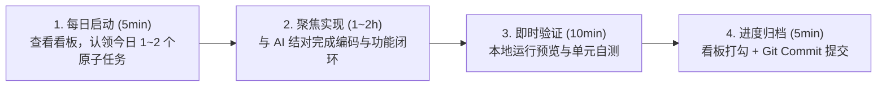

# 「mc」每日推进与研发规划指南 (Daily Development Plan & Roadmap)

> 本文档旨在为 **「mc」多维知识库与协同系统** 提供清晰、可落地、按天推进的日常开发路径与协作节奏，确保每天都有明确的产出与阶段性闭环。

---

## 目录
- [一、 每日推进工作法 (Daily Cadence & Workflow)](#一-每日推进工作法-daily-cadence--workflow)
- [二、 整体演进阶段 (Master Milestones)](#二-整体演进阶段-master-milestones)
- [三、 35天按日精细化拆解规划 (Day-by-Day Sprint Plan)](#三-35天按日精细化拆解规划-day-by-day-sprint-plan)
  - [Sprint 1: 脚手架与核心编辑器 (Day 1 - 7)](#sprint-1-脚手架与核心编辑器-day-1---7)
  - [Sprint 2: 多维数据库引擎与三重视图 (Day 8 - 14)](#sprint-2-多维数据库引擎与三重视图-day-8---14)
  - [Sprint 3: Yjs 实时协同与服务端管道 (Day 15 - 21)](#sprint-3-yjs-实时协同与服务端管道-day-15---21)
  - [Sprint 4: 资产存储、鉴权与邀请闭环 (Day 22 - 28)](#sprint-4-资产存储鉴权与邀请闭环-day-22---28)
  - [Sprint 5: 桌面端、数据迁移与 Docker 交付 (Day 29 - 35)](#sprint-5-桌面端数据迁移与-docker-交付-day-29---35)
- [四、 动态进度跟踪看板 (Living Progress Tracker)](#四-动态进度跟踪看板-living-progress-tracker)
- [五、 与 AI 结对编程的高效推进实践](#五-与-ai-结对编程的高效推进实践)

---

## 一、 每日推进工作法 (Daily Cadence & Workflow)

为了避免“项目宏大但无从下手”或“单日目标过大导致烂尾”，建议采用 **单日微迭代闭环法（Daily Micro-Sprint）**：



### 每日打卡核心原则：
1. **原子化交付**：每天只聚焦一个具体的“可交互点”（如“实现标题块与段落块的快捷键转换”、“完成表格列宽调整”），确保当天能看到实际效果。
2. **状态透明**：每天开始时直接查看本文档第四部分的 **[动态进度看板]**，完成即打勾 `[x]`。
3. **保持主干随时可用**：每天结束时的代码均能正常编译、启动，不遗留阻断性红错。

---

## 二、 整体演进阶段 (Master Milestones)

| 阶段 | 核心目标 | 预计周期 | 关键交付物 |
| :--- | :--- | :--- | :--- |
| **Phase 1: 基础设施与骨架** | Monorepo 工程结构、Docker 开发环境、基础 UI 规范 | 3~4 天 | Turborepo / pnpm 脚手架、Postgres & MinIO 容器环境 |
| **Phase 2: 块级富文本编辑器** | 树状 Block 渲染引擎、常用块类型、快捷斜杠指令 | 7~8 天 | 可流畅编辑、拖拽重排、支持 Markdown 快捷语法的富文本编辑器 |
| **Phase 3: 多维数据库系统** | 表格 (Table)、看板 (Board)、画廊 (Gallery) 视图及基础属性 | 7~8 天 | 支持增删改查、排序、多条件筛选、状态拖拽的多维数据库组件 |
| **Phase 4: 实时协同与服务端** | Yjs CRDT 同步通道、WebSocket 网关、状态持久化 | 7 天 | 双客户端/双标签页毫秒级无冲突编辑与光标感知 |
| **Phase 5: 账户、安全与资产** | 扁平化工作区、管理员引导、邀请码注册、S3 附件上传 | 5 天 | 完整登录邀请闭环、图片/文件附件即时上传渲染 |
| **Phase 6: 客户端与私有化发布** | Tauri 桌面端、数据导入导出 (Markdown/JSON)、一键部署 | 4~5 天 | Docker Compose 一键启动包、Windows/macOS 桌面应用安装包 |

---

## 三、 35天按日精细化拆解规划 (Day-by-Day Sprint Plan)

### Sprint 1: 脚手架与核心编辑器 (Day 1 - 7)
> **阶段目标**：跑通前后端开发环境，构建纯粹丝滑的块级富文本编辑体验。

- [x] **Day 1: mc_web 前端框架与 Notion 风格工作区布局搭建** *(已完成)*
  - 初始化 React 18 + Vite + TypeScript + Tailwind CSS + Lucide 前端工程骨架
  - 实现侧边栏无限层级递归文档树、页面新建/删除/重命名/收藏与展开折叠
  - 实现顶栏动态面包屑、协同状态占位 UI（静态文案，未接入在线感知）与明暗 (Light/Dark) 双主题切换
  - 实现文档详情页：Emoji 图标选择器、Banner 封面图更换、实时响应式大标题
  - 实现全局快捷搜索模态框 (`Ctrl+K` / `Cmd+K`)
  - 验证 TypeScript 零类型错误与 Vite 生产构建顺利通过 (Exit Code 0)
- [x] **Day 2: Block 富文本编辑器核心与常用块类型渲染** *(已完成)*
  - **交付目标**：将详情页静态正文接入编辑器，实现基础块编辑闭环；已完成内核选型与核心组件开发。
  - [x] **内核与数据契约**：完成 TipTap / BlockSuite / 自主轻量块树引擎全维度对比评估；最终确立自主轻量块树引擎方案，保证与 BlockNode 数据契约 1:1 天然对齐，为 Sprint 3 Yjs Y.Array<Y.Map> 协同打通底座；落实唯一稳定 ID、空文档默认段落及未知块保底渲染机制。
  - [x] **组件与状态绑定**：在 `mc_web/src/components/editor/` 建立 `BlockEditor`、`BlockItem`、`TextBlock`、`DividerBlock`、`BlockTypeSelector` 等模块化组件，替换 `DocumentPage.tsx` 静态正文；通过 Store `updateDocumentBlocks` 实现不可变响应式更新，通过 `key={doc.id}` 彻底杜绝切页串写与闭包污染。
  - [x] **基础块操作**：实现 Paragraph、H1-H3 实时编辑与类型切换（保留文本内容与稳定 ID），提供悬浮操作条与下拉切换入口；实现 Divider 分割线插入与删除，末尾分割线后自动追加段落确保可继续输入。
  - [x] **键盘与输入边界**：实现 Enter 光标处拆分（标题拆分降级为段落，块首 Enter 向上插入段落）；实现 Backspace 在光标 0 处合并（标题降级段落、首块越界拦截保底、分割线相邻安全删除）；完整处理中文输入法 IME 合成锁 (`isComposing`) 避免误拆误删；支持纯文本多行粘贴自动分块与撤销/重做 (Undo/Redo) 历史栈。
  - [x] **验收归档**：编写并执行自动化测试套件 `scripts/verify-day2.mjs` 全部通过，`npm run build` 零错误通过。
- [ ] **Day 3: 列表与待办块实现 (Todo / List)**
  - 实现无序列表 (Bullet list)、有序列表 (Numbered list)
  - 实现待办清单 (Todo block)，支持点击勾选与划线状态
  - 支持 `Tab` / `Shift+Tab` 缩进与降级嵌套
- [ ] **Day 4: 增强块组件 (Code / Quote / Callout)**
  - 代码高亮块 (Code block)：支持语言选择、语法高亮与一键复制代码
  - 引用块 (Quote block) 与 提示块 (Callout block，支持自定义 Icon 与背景色)
- [ ] **Day 5: 斜杠指令 (Slash Command `/`) 与浮动菜单**
  - 输入 `/` 呼出块选择快捷菜单（支持模糊拼音/英文搜索过滤）
  - 选中文字后呼出 Bubble Menu（加粗、斜体、下划线、删除线、行内代码、超链接）
- [ ] **Day 6: 块级拖拽排序与批量操作**
  - 实现块左侧 `6-dot` 悬浮手柄（Grip handle）
  - 支持块级拖拽重排与批量框选
- [ ] **Day 7: 本地离线持久化 (IndexedDB) 与 Sprint 1 阶段总结**
  - 本地状态即时自动保存 (IndexedDB)
  - Sprint 1 整体编辑体验调优与代码审查

---

### Sprint 2: 多维数据库引擎与三重视图 (Day 8 - 14)
> **阶段目标**：实现类似 Notion 的结构化数据表格，并无缝切看板与画廊视图。

- [ ] **Day 8: 多维数据库 Schema 设计与底层数据层**
  - 设计 Database、Column/Property、Row/Item、Cell 核心数据结构
  - 在前端实现响应式 Database Store (Zustand 或 TanStack Table)
- [ ] **Day 9: 表格视图 (Table View) 核心交互**
  - 表格行/列渲染、平滑滚动、列宽自由拖拽调整
  - 单元格即时点按编辑（Inline Editing）
- [ ] **Day 10: 基础字段类型系统 (Property Types)**
  - 文本 (Text)、数字 (Number)、勾选框 (Checkbox)
  - 单选标签 (Select) 与 多选标签 (Multi-select)，支持自定义标签颜色
- [ ] **Day 11: 扩展字段类型与行详情弹窗**
  - 日期 (Date，带日期选择器)、超链接 (URL)、创建时间等
  - 点击行展开为“页面级详细视图 (Row as Page)”，支持在行内继续写文档
- [ ] **Day 12: 看板视图 (Board / Kanban View)**
  - 按单选/状态字段自动分组分列
  - 卡片在列间拖拽移动，自动更新所属状态字段
- [ ] **Day 13: 画廊视图 (Gallery View) 与视图切换器**
  - 网格卡片布局，支持封面图展示与自定义展示字段开关
  - 顶栏 Tab 视图切换器（在同一个 Database 上平滑切换 Table / Board / Gallery）
- [ ] **Day 14: 筛选 (Filter) 与 排序 (Sort) 引擎**
  - 支持多字段组合条件筛选（如 `状态等于 In Progress` 且 `优先级等于 High`）
  - 支持升序/降序多重排序，Sprint 2 综合体验调优

---

### Sprint 3: Yjs 实时协同与服务端管道 (Day 15 - 21)
> **阶段目标**：打通双人/多人毫秒级实时协同、光标感知与服务端持久化。

- [ ] **Day 15: 后端 Hocuspocus / y-websocket 服务搭建**
  - 使用 Node.js + Hocuspocus 搭建轻量级 WebSocket 协同服务
  - 配置客户端 Yjs Provider 与 WebSocket 自动心跳重连
- [ ] **Day 16: 编辑器 Yjs 双向数据绑定与无冲突合并**
  - 将前端编辑器状态与 Yjs Doc 绑定
  - 测试两个浏览器窗口同时输入，验证无锁自动合并（Zero-conflict merge）
- [ ] **Day 17: 实时光标与在线人员感知 (Awareness)**
  - 实现协同光标（带用户名、随机分配头像颜色的实时光标飘浮）
  - 顶栏展示当前正在浏览/编辑该页面的在线人员头像列表
- [ ] **Day 18: 多维数据库的 Yjs 协同同步**
  - 将 Database 行列增删与单元格更新同步至 Y.Array / Y.Map
  - 多人同时修改表格数据保持强一致性
- [ ] **Day 19: 服务端快照与 PostgreSQL 二进制持久化**
  - Hocuspocus 钩子 (`onStoreDocument`, `onLoadDocument`) 对接 PostgreSQL
  - 定期防抖将 Yjs 二进制 State 压缩保存至数据库
- [ ] **Day 20: 离线容灾与断网重连追加同步**
  - 客户端通过 `y-indexeddb` 缓存离线编辑
  - 断网恢复后自动双向 Diff 合并补发 Update
- [ ] **Day 21: 协同通道压测与连接稳定性优化**
  - 模拟网络丢包、弱网环境下的协同一致性测试与 Sprint 3 总结

---

### Sprint 4: 资产存储、鉴权与邀请闭环 (Day 22 - 28)
> **阶段目标**：建立简洁安全的邀请制协同空间与多媒体对象存储服务。

- [ ] **Day 22: PostgreSQL 用户与空间模型 (Prisma / Drizzle)**
  - 设计 User, Workspace, InviteToken, DocumentMeta 关系表
  - 实现 JWT 鉴权与 Session 维持中间件
- [ ] **Day 23: 首次部署管理员初始化向导 (Setup Wizard)**
  - 检测系统无 Admin 时，首次访问强制展示引导页
  - 创建首个超级管理员账号与默认工作区
- [ ] **Day 24: 邀请链接与邀请码系统**
  - 管理员可在设置面板生成邀请链接（可设过期时间 / 可用次数）
  - 被邀请人通过专属链接注册，直接加入空间
- [ ] **Day 25: S3 / MinIO 附件服务对接**
  - 服务端接入 S3 兼容 SDK（支持 MinIO、Cloudflare R2、OSS、AWS S3）
  - 实现预签名直传 (Pre-signed URL) 或流式中转上传接口
- [ ] **Day 26: 编辑器图片与文件块集成**
  - 图片块 (Image Block)：支持粘贴图片直接上传、拖拽缩放尺寸、灯箱大图预览
  - 附件块 (File Block)：支持 PDF/文档拖入并显示文件大小与下载
- [ ] **Day 27: 页面封面 (Cover) 与 图标 (Icon) 选择器**
  - 页面顶部支持设置 Emoji / 预设图标
  - 页面顶部支持上传或选择预设 Banner 封面图
- [ ] **Day 28: 权限边界与安全审查**
  - 接口防越权拦截与 XSS / 敏感字段脱敏，Sprint 4 总结

---

### Sprint 5: 桌面端、数据迁移与 Docker 交付 (Day 29 - 35)
> **阶段目标**：完成全平台打包、数据备份迁移引擎与一键私有化部署。

- [ ] **Day 29: Tauri 跨平台桌面端集成**
  - 配置 Rust + Tauri 2.0 脚手架，打包 Web 资源
  - 适配本地窗口边框、快捷键（`Ctrl+N` 新建、`Ctrl+P` 快速查找）
- [ ] **Day 30: 快速全局搜索 (Command Palette `Ctrl+K`)**
  - 实现全文档标题与内容全文模糊检索弹窗
  - 键盘上下键极速跳转至对应页面
- [ ] **Day 31: 数据导出引擎 (Markdown / JSON)**
  - 支持单页导出为干净的 `.md` 文件（含内嵌图片资源打包）
  - 支持整个工作区全量备份为 `.zip` (JSON Schema + 附件包)
- [ ] **Day 32: 数据导入引擎 (Notion / Markdown 导入)**
  - 支持拖入标准 Markdown 文件自动解析为 mc 块级文档
  - 支持导入 CSV 为多维表格数据
- [ ] **Day 33: 生产级 Docker Compose 配置**
  - 编写单命令部署文件 `docker-compose.yml`（包含 Web 前端、Server、PostgreSQL、MinIO）
  - 配置 Nginx 反向代理与环境参数模版 `.env.example`
- [ ] **Day 34: 端到端功能完整性走通与性能调优**
  - 全流程测试：初始化向导 -> 邀请注册 -> 协同编辑 -> 多维数据 -> 附件上传 -> 备份导出
  - 首屏加载性能调优与包体积瘦身
- [ ] **Day 35: v1.0 正式发布与发布说明整理**
  - 编写完善的用户手册与部署文档
  - 打包 Windows / macOS 客户端安装包，完成 v1.0 交付

---

## 四、 动态进度跟踪看板 (Living Progress Tracker)

> 💡 **使用说明**：随着每天的推进，直接修改此处的复选框 `[ ]` 为 `[x]`，并记录当天的简要备注。

### 📊 当前整体进度概览
- **当前所处 Sprint**: **Sprint 1 (脚手架与核心编辑器)**
- **已完成天数**: `2 / 35`
- **总体完成度**: `6%`

```
[██░░░░░░░░░░░░░░░░░░░░░░░░░░░░░░░░░░░░░░░] 6%
```

### 🎯 明日聚焦 (Next Day's Focus)
- **目标**: 完成 **Day 3: 列表与待办块实现 (Todo / List)**
- **状态**：待开始；任务见 Sprint 1 的 Day 3。
- **预期产出**：无序列表 (Bullet list)、有序列表 (Numbered list)、待办清单 (Todo block) 的编辑交互与 Tab / Shift+Tab 缩进降级支持。

### Day 1 核查记录（2026-09-10）

- **依据**：mc_web/package.json、src/types/document.ts、src/store/useWorkspaceStore.ts、src/pages/DocumentPage.tsx 及布局/搜索组件。Day 1 按“前端框架与工作区布局”范围保留完成状态，不代表全部基础设施完成。
- **已有实现**：React 18.3.1 + Vite + TypeScript + Tailwind CSS + Lucide + Zustand；递归页面树、页面操作、面包屑、主题、Emoji 和预设远程封面更换。重命名通过详情页标题输入框完成；搜索为标题与顶层块文本子串匹配，支持方向键选择和回车跳转。
- **正文基线**：已有 BlockNode 定义及 H1-H3、段落、callout、bulletList 展示和 todo 勾选；正文仍为静态渲染，未安装编辑器依赖，Divider 尚无专用渲染。
- **能力边界**：顶栏“双人协同就绪”为静态文案。文档仅存于 Zustand 内存，刷新会重置，只有主题保存至 localStorage。Monorepo、服务端、PostgreSQL 和 MinIO 尚未落地，当前从 mc_web 使用 npm 开发。
- **待修问题**：deletePage 仅删除指定页面，未处理后代页面，会留下孤立子页面。列入 Sprint 1 待修项，在 Day 7 收尾前明确级联删除或子页面提升规则并验证。
- **本次验证**：源码核查完成；npm run build（tsc && vite build）重跑通过，退出码 0。首次在清理旧产物时遇到权限错误，获准重跑后通过；未进行浏览器全量交互验收。

### Day 2 核查记录（2026-09-10）

- **内核与数据契约结论**：经系统评测，BlockSuite 的 Web Components Shadow DOM 严重阻隔 Tailwind CSS 设计令牌共享；TipTap 全文树在离散块拖拽与多维数据库嵌入时易产生光标与事件陷阱。最终确立自主轻量块树引擎架构 (`mc-block-engine`)，与 `types/document.ts` 的 `BlockNode` 契约 1:1 天然契合，为 Sprint 3 接入 Yjs `Y.Array<Y.Map>` CRDT 提供最为平滑的底层映射。
- **核心组件交付**：在 `mc_web/src/components/editor/` 交付 `BlockEditor.tsx`、`BlockItem.tsx`、`TextBlock.tsx`、`DividerBlock.tsx`、`BlockTypeSelector.tsx`。
- **状态与响应式接入**：在 `useWorkspaceStore.ts` 扩展 `updateDocumentBlocks` 接口，在 `DocumentPage.tsx` 接入 `<BlockEditor key={doc.id} />`，严格隔离文档生命周期，避免切页状态污染与回写冲突。
- **输入边界与键盘交互**：
  - Enter：光标处拆分，标题回车自动降级段落，首位 Enter 向上插入段落。
  - Backspace：标题退格先降级为段落；文本块首与前置文本合并且光标定位至拼接点；相邻分割线安全删除；首块越界防护（始终保留至少一个可编辑段落）。
  - 分割线：聚焦/删除/回车自动追加段落，不可键入文字。
  - 输入法保护：完整挂载 `isComposing` 与 `onCompositionStart/End` 合成锁，彻底杜绝中文拼音候选阶段误拆块。
  - 剪贴板与历史：支持多行文本粘贴自动拆解为独立块；提供 `Ctrl+Z` / `Ctrl+Y` 本地 Undo/Redo 历史栈。
- **既有数据兼容**：完整保留并兼容 `welcome-page` 等示例中的 `todo`、`callout`、`bulletList` 块，勾选与展示正常工作。
- **构建与测试验证**：编写并运行 `scripts/verify-day2.mjs` 覆盖拆分、合并、降级、边界、分割线、粘贴及全局搜索 6 大测试集全部通过；`npm run build`（tsc && vite build）无错误构建成功（Exit Code 0）。

### Day 2 验收清单（已完成逐项核查）

- [x] 新建页面可立即输入；Paragraph、H1-H3 切换保留文本，Divider 可插入/删除且后方可继续输入。
- [x] 在文本开头、中间、末尾验证 Enter 拆分与 Backspace 合并；覆盖空标题、首块、唯一空段落及分割线相邻场景，无文字丢失、重复块或光标跳转。
- [x] 中文输入法确认候选不会误拆块；纯文本粘贴、撤销/重做正常。
- [x] 编辑 A → 切至 B → 返回 A，内容保留且两页互不覆盖；新文本可被搜索找到，旧示例数据与已有交互保留。
- [x] 标题、树导航、收藏、搜索和明暗主题无回归；刷新持久化留待 Day 7。
- [x] 在 mc_web 执行 npm run build 通过，记录手工验收与遗留问题，再同步 README 和进度看板。

---

## 五、 与 AI 结对编程的高效推进实践

当您每天准备推进项目时，可以按照以下提示词模式与 AI 协作：

### 1. 每日启动提示词
```text
"今天我们推进 [Sprint X - Day Y: 具体任务名]，请查看 DAILY_DEVELOPMENT_PLAN.md 中的任务清单，给出今天这一步的实现步骤，并开始第一步编码。"
```

### 2. 每日收尾与打卡提示词
```text
"今天的代码已经验证完成，请帮我：
1. 更新 DAILY_DEVELOPMENT_PLAN.md 中的看板进度与完成度；
2. 总结今日完成的核心点，并给出明天的预告建议。"
```

---
*「千里之行，始于足下。保持每日推进，打造自主可控的下一代知识库系统！」*
