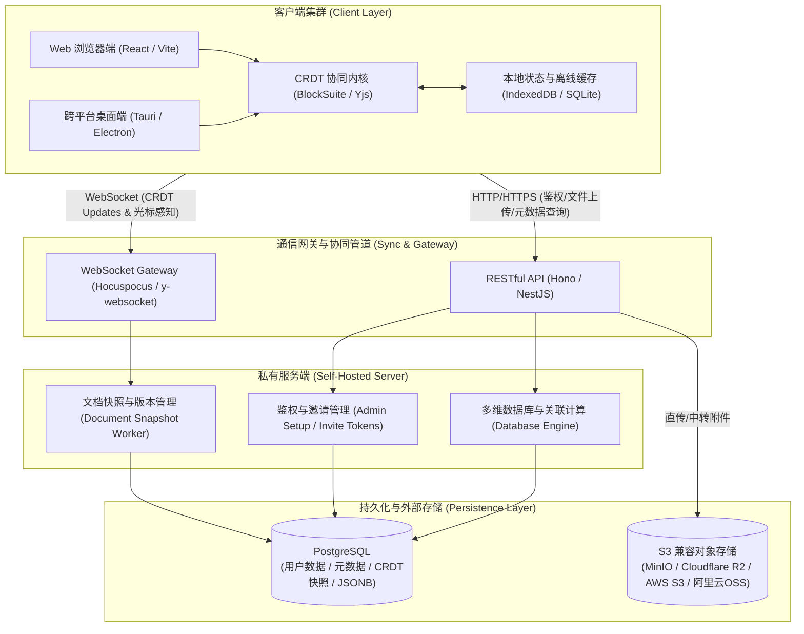
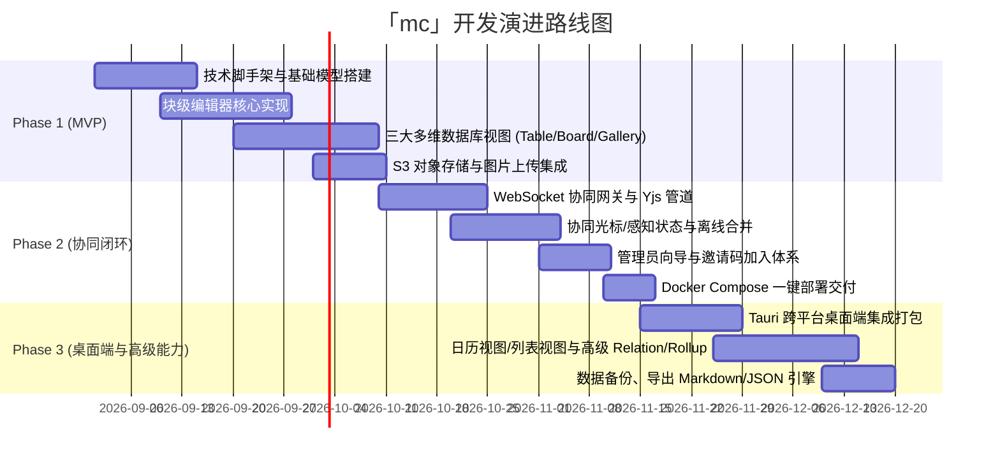

# 「mc」知识库与多维数据库系统架构与开发规划方案 (Product Architecture & Planning)

---

## 一、 项目背景与产品定位

### 1. 项目名称
**`mc`** (Modular Collaboration / Multi-dimension Core)

### 2. 产品定位
自主可控、私有化部署、支持本地极速响应与双人/多人无缝实时协作的 **Notion 级多维知识库与结构化数据库平台**。

### 3. 对比与破局
| 维度 | Notion (官方云端) | Obsidian (本地笔记) | **mc (本项目目标)** |
| :--- | :--- | :--- | :--- |
| **数据所有权** | 官方云端托管，有隐私与合规担忧 | 本地 Markdown，完全私有 | **100% 自建私有化**（自建 PostgreSQL + S3 兼容存储） |
| **双人/多人实时协同** | 优秀（中心化协同） | 极弱（基于文件同步易产生合并冲突） | **原生 CRDT 毫秒级双向协同**，无冲突合并，带实时光标 |
| **多维关系型数据库** | 强大（Table/Board/Gallery/Relation） | 弱（仅依赖第三方社区插件） | **内置原生多维数据库引擎**，支持表格/看板/画廊与双向关联 |
| **部署与扩展性** | 闭源 SaaS | 客户端软件 | **Docker Compose 一键私有化交付**，支持 Web 与跨平台桌面端 |

---

## 二、 整体系统架构设计



---

## 三、 核心模块与功能设计

### 1. 块级富文本编辑器 (Block-based Editor)
- **底层架构**：基于树状 Block 节点结构（Node Tree），每个 Block 拥有独立唯一 ID、类型、属性及内容数据。
- **内容块类型 (Block Types)**：
  - 基础块：段落 (Paragraph)、各级标题 (H1-H6)、无序/有序列表、任务待办 (Todo)、引用 (Quote)、分割线。
  - 增强块：代码高亮块 (多语言支持与复制)、Callout 提示卡片、数学 LaTeX 公式、Mermaid 流程图/时序图渲染。
  - 页面与引用块：行内双向链接（`[[Page Title]]`）、嵌套子页面（Sub-page）、页面内嵌入多维数据库。
- **协同体验**：
  - 多人协同实时光标位置、当前选中块高亮与人员头像感知（Awareness）。
  - 块级拖拽排序、批量框选操作、快捷斜杠指令（`/` Slash Commands）。

### 2. 多维结构化数据库 (Relational Multi-view Database)
- **MVP 核心三大多维视图**：
  1. **表格视图 (Table View)**：类 Excel 极速单元格编辑、列宽调整、冻结首列、按多条件筛选 (Filter)、多字段排序 (Sort) 与分组 (Group)。
  2. **看板视图 (Board / Kanban View)**：按单选/状态字段自动分列，支持卡片在列间自由拖拽以实时更新底层字段状态。
  3. **画廊视图 (Gallery View)**：网格卡片式布局，支持设置封面图（Cover）与展示特定摘要属性。
- **MVP 字段类型系统 (Properties)**：
  - 单行文本 (Text)、数字 (Number)、单选标签 (Select)、多选标签 (Multi-select)、日期时间 (Date)、勾选框 (Checkbox)、URL 链接、人员 (User)。
  - **双向关联属性 (Relation)**：支持关联另一个 Database 的数据记录，实现跨表数据引用。
- *(后续 Phase 规划：日历视图 Calendar、列表视图 List、计算公式 Formula 与 汇总 Rollup)*。

### 3. 多人实时协同与同步引擎 (CRDT & Sync Engine)
- **确定性协同机制**：基于 **Yjs CRDT** 算法，所有客户端的并发编辑操作均被编译为增量二进制 Update，网络合并时完全无锁且具备确定性（最终一致性），彻底消除 Obsidian 文件冲突提示。
- **本地优先与离线容灾**：
  - 客户端本地通过 IndexedDB / 嵌入式存储即时写入，UI 零延迟响应。
  - 断网状态下支持继续阅读与编写；网络重连后，WebSocket 自动将本地离线 Update 与服务端进行双向 Diff 与追加合并。
- **服务端持久化**：WebSocket 协同服务（基于 Hocuspocus / y-websocket）定期将 Yjs 内存文档打包为持久化二进制快照存入 PostgreSQL，并保留操作日志以便版本回退。

### 4. 极简团队/双人协作与鉴权体系 (Collaboration & Auth)
- **扁平化共享空间模型**：
  - 针对双人、独立合作者或敏捷小团队优化，去除繁琐的 RBAC 复杂权限配置，部署后即为一个统一的高效协作库。
  - 空间内所有成员对页面和数据库拥有平等的实时读写、新建与修改权限。
- **安全初始化与邀请注册闭环**：
  1. **首次初始化向导 (Setup Wizard)**：服务部署首次打开时，检测到无管理员，引导创建首个主管理员账号与工作区名称。
  2. **邀请码 / 邀请链接机制**：管理员可在系统设置中生成具有时效/次数限制的专属邀请链接，被邀请者凭链接完成账号注册并直接进入共享空间，防止服务公网暴露时被外界恶意滥注。
  3. **基于 JWT 的安全会话**：提供安全的 Token 刷新与多端会话维持机制。

### 5. 存储架构与数据持久化 (Storage & Data Persistence)
- **无状态服务端 + S3 对象存储**：
  - 服务端本身保持纯无状态设计，所有用户上传的图片、音视频、PDF、文档附件直接存入 S3 兼容对象存储（支持自建 MinIO、Cloudflare R2、AWS S3、阿里云 OSS、Rust S3 等）。
  - 支持客户端直接通过预签名 URL (Pre-signed URL) 上传/拉取附件，释放服务端带宽压力。
- **关系与元数据存储 (PostgreSQL)**：
  - 存储用户账号体系、工作区元数据、数据库 Schema、页面关系拓扑图以及 Yjs 文档二进制增量快照。
  - 支持一键导出 JSON / 批量导出 Markdown 文档包，保证数据随时可迁移备份。

---

## 四、 推荐技术选型 (Tech Stack)

```
mc
├── 客户端前端 (Frontend)
│   ├── 核心框架: React 18 / 19 + TypeScript + Vite + Tailwind CSS + Shadcn UI
│   ├── 编辑器与协同内核: BlockSuite (或 TipTap) + Yjs + y-indexeddb
│   └── 跨平台桌面端壳: Tauri (Rust 跨平台超轻量打包) 或 Electron
│
├── 服务端后端 (Backend)
│   ├── 应用框架: Node.js / TypeScript (Hono 或 NestJS)
│   ├── 协同服务: Hocuspocus (高性能 Node Yjs WebSocket 协同网关)
│   ├── ORM 与数据交互: Prisma 或 Drizzle ORM
│   └── 资产服务: AWS S3 SDK (适配兼容所有 S3 协议端点)
│
└── 基础实施与部署 (Infrastructure)
    ├── 主数据库: PostgreSQL 15+
    ├── 资产存储: S3 兼容存储 (MinIO / Cloudflare R2 / 自建对象存储)
    └── 交付形式: Docker & Docker Compose 一键拉起配置文件
```

---

## 五、 项目推进路线图 (Roadmap)



---

## 六、 立即开始开发的第一步建议

1. **初始化代码仓库结构 (Monorepo 推荐)**：
   - `apps/web`: React Web & 桌面 UI 界面
   - `apps/desktop`: Tauri 桌面客户端入口
   - `apps/server`: Node.js API + WebSocket 协同服务
   - `packages/schema`: 数据库 Prisma Schema 与共享类型定义
2. **编写 `docker-compose.yml` 开发环境**：包含 PostgreSQL 16 与本地 MinIO 对象存储，实现开发环境秒级启动。
3. **快速验证 Block 编辑器与 Yjs 协同连接管道**。
